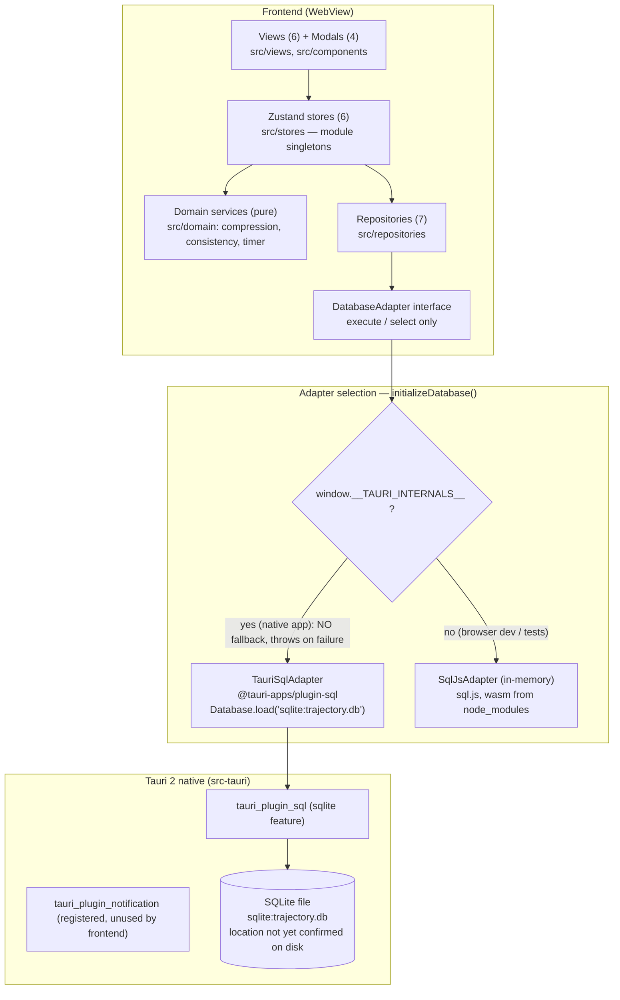
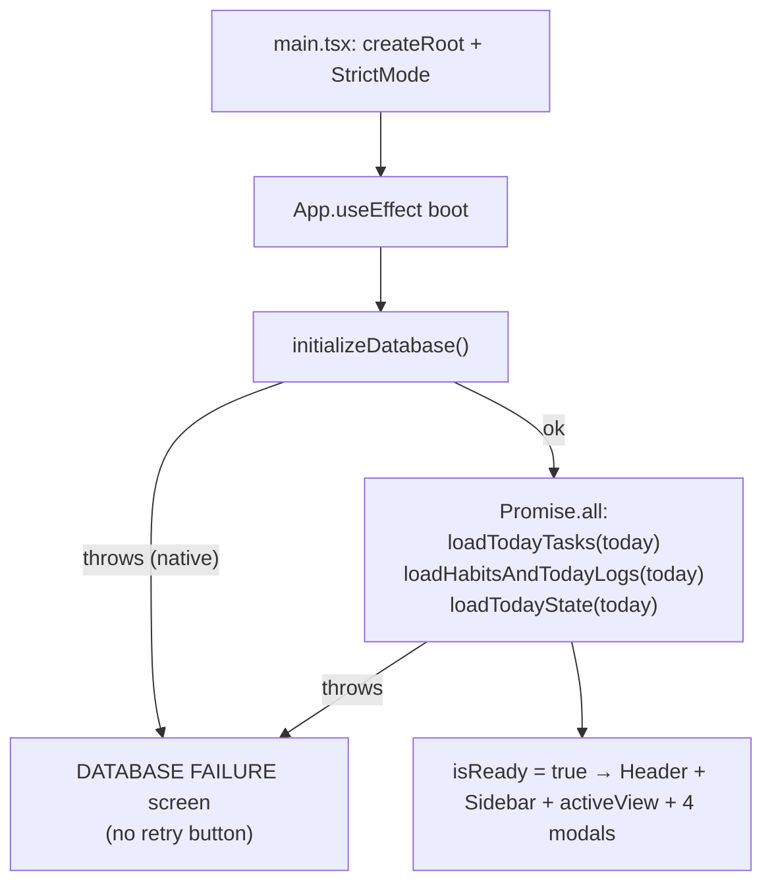
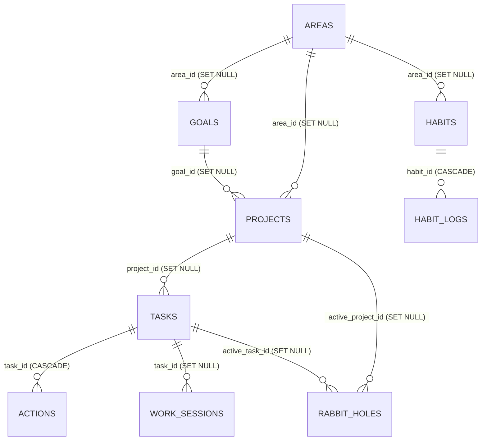
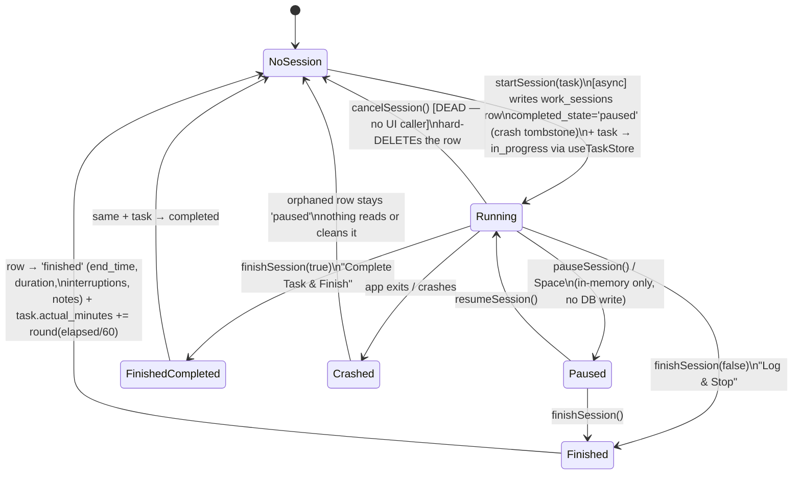
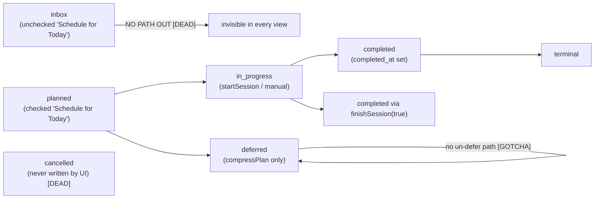

# Trajectory — Repository Knowledge Graph

> **Snapshot:** commit `0c2db9b` on `main`, 2026-09-04. Working tree clean, branch `main`, **no git remote configured**.
> **Audience:** every agent (and human) about to modify this repository. Read §1–§4 before writing code; search §10 (gotcha index) before assuming anything works the way you expect.
> **Trust markers used throughout:** `[VERIFIED]` = proven against the real repo/environment · `[UNVERIFIED]` = plausible but never exercised · `[GOTCHA]` = trap that has already bitten or will · `[DEAD]` = exists but unreachable from any UI/test path.
> **This file is load-bearing.** If you discover reality contradicting anything here, fix the code or fix this file — in the same commit (see §11 Maintenance protocol).

---

## 1. How to use this document

1. **Before planning work:** skim §2 (non-negotiables), §3 (architecture), §4 (entity graph).
2. **Before editing a subsystem:** find it in §6 (inventories) and check §10 (gotchas) for its tags.
3. **Before claiming done:** run the gates in §7 (runbook) and update §8 (verification ledger). Never substitute passing sql.js (in-memory) tests for native Tauri verification — that substitution is the original sin this project's Phase 1.5 exists to correct.
4. **After work:** update §8 and §10, bump the snapshot header, commit together with your change.

Companion documents, in order of authority:
- `.agents/rules/project.md` — master rulebook (always-on).
- `.agents/skills/{product-design,testing,tauri-engineering,database,ui-design}/SKILL.md` — domain doctrines. **`database/SKILL.md` and `ui-design/SKILL.md` are truncated/corrupt on disk** (both end mid-code-fence; database loses its timestamp conventions, ui-design loses everything after the Today-screen ASCII mockup).
- `.agents/workflows/{build-feature,review,release}.md` — process checklists. **`release.md` references `pnpm lint` which does not exist** (no lint/format tooling is installed).
- `docs/{PRODUCT,ARCHITECTURE,DATA_MODEL,ROADMAP}.md` — product/architecture specs; several claims are stale — see the trust map in §9.4 before citing them.
- `walkthrough.md` — latest session-level status report (Phase 1.5 Day 1).

---

## 2. Product identity & non-negotiables

Trajectory is a **personal execution operating system**: its job is to answer *"What should I actually do right now?"* and to record behavioral truth without judgment.

**Axioms** (from `docs/PRODUCT.md` / `project.md`): execution over configuration · trajectory over perfection · **recovery over guilt** · behavioral data over productivity theatre · capture curiosity, don't suppress it · AI as augmentation, never a dependency.

**Hard prohibitions** — never implement:
- guilt-inducing language, productivity scores implying personal worth, destructive streak mechanics, notification spam.
- Consequences: habits use dual targets (normal + minimum viable) with weighted scoring (minimum = 0.6 credit, never a reset); compression copy is shame-free ("Pushed to Deferred (No Guilt)"); no punishment anywhere in UX.

**UX priority order:** 1. Today → 2. Current task → 3. Energy/state → 4. Habits → 5. Quick capture → 6. Review. One clear primary action per screen; calm/technical/understated tone; no gamification, gradients-on-everything, or motivational quotes.

**Stack mandates** (`project.md`): React + TypeScript + Vite + Tailwind + Zustand + Zod + Lucide; Tauri 2 + Rust for desktop; **SQLite via the official Tauri SQL plugin only**; "Do not implement native functionality through browser APIs when a Tauri-native solution exists"; "React components must not contain raw SQL queries"; layering `UI → Application state → Domain services → Persistence/Tauri APIs`.

**Known governance violation** `[GOTCHA]`: `src/views/ProjectsView.tsx` runs raw SQL via `getDatabase()` directly inside a React component — the only place this happens. It violates project.md, database skill, and review.md. Do not copy this pattern; it is recorded as tech debt in §9.3.

**Development gate** (10 steps, from project.md): inspect architecture → identify files → explain plan → check for reusable abstraction → smallest coherent version → format → typecheck → tests → run app when visual verification is relevant → report what changed and what was verified. There is **no formatter/linter installed**, so steps 6 is currently a no-op (`pnpm lint`/`format` scripts don't exist).

---

## 3. System architecture graph

### 3.1 Runtime layer graph `[VERIFIED]`

- `[GOTCHA]` Inside Tauri a DB failure **throws** (commit `39b506f`) → App renders the `DATABASE FAILURE` screen. Never reintroduce a silent in-memory fallback in native mode: it produced apps that "worked" while deleting all data on exit.
- `[DEAD]` notification plugin is registered in `lib.rs` and granted capabilities, but `@tauri-apps/plugin-notification` is imported nowhere in `src/`.
- `[VERIFIED]` No custom Rust commands exist; frontend↔native boundary is exclusively the SQL plugin.

### 3.2 Boot sequence `[VERIFIED]`

- `today = new Date().toISOString().split("T")[0]` — **UTC date**. `[GOTCHA]` see G-01.
- `[GOTCHA]` On store-load failure (non-native), boot catches, logs, and renders nothing but the spinner forever — only native DB failure has an error screen.

---

## 4. Domain entity graph

### 4.1 Persistence schema (13 tables) `[VERIFIED]` — source of truth: inline `MIGRATION_001` in `src/repositories/database.ts`

Key constraints and semantics:
- All PKs are UUID v4 TEXT; timestamps are UTC ISO-8601; day fields are `YYYY-MM-DD`.
- `tasks.status` CHECK: `inbox | planned | in_progress | completed | cancelled | deferred` (default `inbox`); `importance`: `critical | important | optional`; `cognitive_demand`: `deep | medium | shallow`; soft delete via `deleted_at`.
- `habit_logs`: **UNIQUE(habit_id, date)** — one row per habit per day; `target_met_status` CHECK: `none | minimum | normal | exceeded`.
- `work_sessions.completed_state` CHECK: `finished | interrupted | paused` — **`interrupted` is never written** `[DEAD]`; crash-safety uses `paused` (see §5.1).
- `daily_states`: no UNIQUE on `date`; upsert is lookup-based `[GOTCHA]`.
- `daily_reviews.date` UNIQUE (upsert safe).
- `rabbit_holes.status`: `captured | converted_task | converted_project | converted_idea | archived` — only `captured` is ever written `[GOTCHA]`.
- `_migrations(version PK, name, applied_at)` — currently exactly one row: `1, "001_initial_schema"`. `[GOTCHA]` the runner's DDL exists as **two copies**: inline `MIGRATION_001` string (runtime truth) and `src/repositories/migrations/001_initial_schema.sql` (documentation only, loaded by nothing). Edit both or edit only the string.

### 4.2 Entity coverage map (schema → repo → store → UI)

| Entity | Repository | Store | UI | Notes |
| --- | --- | --- | --- | --- |
| areas | **none** | — | ProjectsView (raw SQL read) | 4 seeded at first run with fixed UUIDs `11111111-…`, `22222222-…`, `33333333-…`, `44444444-…` |
| goals | **none** | — | **none** `[DEAD]` | schema exists, fully unreachable |
| projects | **none** | — | ProjectsView (raw SQL read) | no create/edit path |
| tasks | TaskRepository | useTaskStore | Today, DeepWork, Projects, BrainDump(promote), NewTaskModal, CompressionModal | richest entity; inbox status unreachable from UI |
| actions | TaskRepository (3 methods) | **none** | **none** `[DEAD]` | entire subtask feature: schema + repo only |
| habits | HabitRepository | useHabitStore | TodayView, HabitsView (+HabitsView direct repo calls) | 4 seeded with fixed UUIDs `aaaaaaaa-…`, `bbbbbbbb-…`, `cccccccc-…`, `dddddddd-…` |
| habit_logs | HabitRepository | useHabitStore | TodayView ±15 steppers, HabitsView Min/Full/±10 | upsert per (habit,date) |
| work_sessions | WorkSessionRepository | useSessionStore | DeepWorkView | crash-safe write pattern (§5.1) |
| daily_states | StateRepository | useStateStore | TodayView 4 sliders | seeded defaults 6/6/4/5 `[GOTCHA]` comment says 5 |
| daily_reviews | ReviewRepository | useReviewStore | ReviewView (write) | **loadTodayReview never called** `[DEAD]` — reviews are write-only |
| rabbit_holes | RabbitHoleRepository | **none** | RabbitHoleModal (write-only) | capture exists; list/conversion UI does not `[DEAD]` |
| brain_dumps | BrainDumpRepository | **none** | BrainDumpView (direct repo) | single-slot document (latest row upserted) |

---

## 5. State & data-flow graphs

### 5.1 Deep Work session lifecycle (crash-safe, commit `73796c5`) `[VERIFIED]`

- Elapsed time: `elapsedSeconds` only advances via `tick(1)` from a `setInterval` that exists **only while DeepWorkView is mounted and isRunning**. `[GOTCHA]` navigating away silently stops accumulation.
- `duration_seconds` counts only running time; `start_time`/`end_time` are wall-clock brackets (they include paused gaps). `[GOTCHA]` these two disagree by design — documented here, nowhere else.
- `setNowForTesting(fn)` is an exported clock seam in `useSessionStore` — **unused by any test so far**.
- `startSession` while a session is active is a **silent no-op**, but TodayView still navigates to DeepWorkView (which shows the old session) `[GOTCHA]`.
- Auto-selection rule: completing the active task promotes the first `planned` (else `in_progress`) task to active.

### 5.2 Task status flow `[VERIFIED]`

- `compressPlan` persists only `planned → deferred` transitions and then reloads today's list. Deferred tasks keep their `scheduled_date`, so the SQL still returns them; they disappear because views filter on `planned`/`in_progress`.

### 5.3 Compression algorithm (`compressDayPlan(tasks, availableMinutes)`) — pure, deterministic, non-mutating `[VERIFIED]`

1. Partition by status: `completed` / `in_progress` / `planned`. **`inbox`, `cancelled`, `deferred` inputs are silently dropped from the result** (neither kept nor deferred) `[GOTCHA]`.
2. `committedMinutes` = Σ over completed+in_progress of (`actual_minutes` if > 0 else `estimated_minutes`); `remainingBudget = max(0, available − committed)`.
3. **Critical planned tasks: always kept** (budget may go negative).
4. Important planned tasks: sorted by `order_index` asc, then `estimated_minutes` asc; kept if `est ≤ remainingBudget || remainingBudget > 0` — `[GOTCHA]` the `|| remainingBudget > 0` clause keeps the **first** important task even when it overruns the remaining budget (drives budget negative); later ones must fit.
5. Optional planned tasks: kept only if `est ≤ remainingBudget && remainingBudget > 0` (strict).
6. `totalPlannedMinutes` = Σ kept estimates; `fitsWithinBudget = total ≤ available`; `freedMinutes` = Σ deferred estimates.

Store persistence (`useTaskStore.compressPlan`): marks each deferred task via `updateTask(id, {status:"deferred"})`, reloads, returns `{freedMinutes, deferredCount}`. **No task is created or deleted; completed tasks untouched** — the core invariant "compression changes the plan, not history".

### 5.4 Habit logging & consistency `[VERIFIED]`

- Every log value overwrites the single `(habit_id, date)` row (manual upsert under the UNIQUE index).
- `evaluateTargetStatus(value, normal, minimum)`: `≤0` → none · `< minimum` → none · `[minimum, normal)` → minimum · `[normal, normal×1.5]` → normal · `> normal×1.5` → exceeded. (Exactly 1.5× is still "normal".)
- `calculateRollingConsistency(statuses, windowDays=14)`: score = `normalDays×1.0 + minimumDays×0.6`; percent = `min(100, round(score / max(windowDays, statuses.length) × 100))`; labels: ≥75 "Resilient Trajectory", ≥45 "Minimum Viable Continuity", else "Low Momentum".
- HabitsView uses **7-day** windows (`CONSISTENCY_WINDOW_DAYS = 7`), real history via `HabitRepository.getRecentStatuses(habitId, endDate, days)` — **an unlogged day counts as `none` (missed)**, computed with UTC day math.

### 5.5 Cross-store edges — exactly two, both `useSessionStore → useTaskStore` `[VERIFIED]`

1. `startSession` → `useTaskStore.getState().updateTaskStatus(task.id, "in_progress")`
2. `finishSession(true)` → `useTaskStore.getState().updateTaskStatus(task.id, "completed")`

Everything else is strictly layered. Views that bypass stores and call repositories directly (deliberate but noteworthy): HabitsView (`createHabit`, `getRecentStatuses`), BrainDumpView (`getLatestBrainDump`, `saveBrainDump`), RabbitHoleModal (`createRabbitHole`), ProjectsView (raw SQL `[GOTCHA]`).

### 5.6 Today's-date pattern `[GOTCHA]`

`new Date().toISOString().split("T")[0]` is duplicated at **9 call sites** (App boot, TodayView, DeepWorkView?, HabitsView, BrainDumpView, ReviewView, CompressionModal, NewTaskModal, habitRepository×2). All compute **UTC**, so between 00:00 UTC and local midnight the app's "today" can differ from the user's calendar day. There is no shared date utility; tests additionally hardcode `"2026-09-03"` while views use the real date (TodayView.test renders against whatever day it runs).

---

## 6. Component inventory

### 6.1 Zustand stores (`src/stores/`)

All stores are module singletons with module-level repo instances; no persist middleware; no selectors (views destructure whole stores → re-render on any change).

| Store | State (defaults) | Actions | Test seams |
| --- | --- | --- | --- |
| `useTaskStore` | `tasks: []`, `activeTaskId: null`, `primaryObjective: "Finish Core Engine Architecture & Verification"`, `availableMinutes: 420`, `isLoading` | `loadTodayTasks(date)` (auto-selects active: first in_progress, else first planned), `createTask(params)` (status = scheduled_date ? planned : **inbox**), `updateTaskStatus(id, status)` (sets completed_at; promotes next active on completion), `setActiveTask`, `setPrimaryObjective`, `setAvailableMinutes`, `compressPlan(date)` | real in-memory DB via `setDatabase` |
| `useSessionStore` | `activeSession: ActiveSession | null` (`{sessionId, taskId, taskTitle, startTime, elapsedSeconds, isRunning, interruptionCount, notes}`) | `startSession(task)` **async**, `pauseSession`, `resumeSession`, `tick(delta=1)`, `recordInterruption(note?)`, `updateNotes`, `finishSession(completeTask=false)` **async**, `cancelSession` **async** `[DEAD no UI]` | `setNowForTesting(fn)` clock seam (unused) |
| `useHabitStore` | `habits: []`, `todayLogs: Record<habitId, HabitLog>` | `loadHabitsAndTodayLogs(date)`, `logHabitValue(habitId, date, value, notes?)` (computes target status via domain, persists, merges) | — |
| `useStateStore` | `currentState: DailyState | null` | `loadTodayState(date)` (seeds 6/6/4/5 if absent), `updateMetric(date, metric, value)` (upsert) | — |
| `useReviewStore` | `todayReview`, `recentReviews: []` | `saveReview(review)` (used by ReviewView), `loadTodayReview(date)` `[DEAD never called]` | — |
| `useUIStore` | `activeView: "today"|"deep_work"|"habits"|"brain_dump"|"review"|"projects"`, `activeMode: ExecutionMode` (`"deep_work"` default), 4 modal flags | pure setters: `setActiveView`, `setActiveMode`, `set{RabbitHole,NewTask,Compression,CommandPalette}ModalOpen` | — |

`[GOTCHA]` `primaryObjective` and `availableMinutes` are **memory-only** (lost on restart). ReviewView's "prime tomorrow" writes `setPrimaryObjective` in memory only — never persisted, never read back.

### 6.2 Repositories (`src/repositories/`)

| Repo | Methods (semantics) | Dead / notes |
| --- | --- | --- |
| `TaskRepository` | `getTodayTasks(date)` — `deleted_at IS NULL AND (scheduled_date = ? OR (status='in_progress' AND scheduled_date IS NULL))`, ordered importance→order_index→created_at DESC · `getTaskById` · `createTask` (defaults: important/medium/inbox/30min; returns constructed object, not re-read) · `updateTask` (dynamic SET, always bumps updated_at) | `[DEAD]` `getAllTasks`, `getInboxTasks`, `softDeleteTask` (test-only), `getActionsByTaskId`, `createAction`, `toggleAction` |
| `HabitRepository` | `getAllHabits` (int→bool is_archived) · `createHabit` · `getLogsForDate` · `getLogsForRange(start, end)` · `getRecentStatuses(habitId, endDate, days)` (per-day statuses, unlogged = "none", UTC math) · `logHabit` (manual upsert on UNIQUE(habit,date)) | — |
| `WorkSessionRepository` | `createSession` · `updateSession` (dynamic SET, no updated_at column) · `deleteSession` (hard DELETE) | `[DEAD]` `getRecentSessions`, `getSessionsForTask`, `getTodayTotalDuration` (the repo's one prefix-LIKE `start_time LIKE 'date%'` query) |
| `StateRepository` | `getDailyState` (latest by logged_at) · `saveDailyState` (lookup upsert) | no UNIQUE(date) in schema |
| `ReviewRepository` | `getDailyReview` · `saveDailyReview` (lookup upsert on UNIQUE date) · `getRecentReviews(7)` | — |
| `RabbitHoleRepository` | `createRabbitHole` (always status 'captured') | `[DEAD]` `getAllRabbitHoles`, `updateStatus` (conversion machinery unreachable) |
| `BrainDumpRepository` | `getLatestBrainDump` · `saveBrainDump` (upsert latest row → single-slot doc) | — |
| `database.ts` | `initializeDatabase` (Tauri hard-fail / browser sql.js) · `createInMemoryDatabase` (loads wasm from node_modules under Node) · `runMigrations` (version-checked, idempotent DDL) · `seedDefaultsIfEmpty` (4 areas + 4 habits, fixed UUIDs) · `getDatabase`/`setDatabase` (test seam) | `MIGRATION_001` inline vs `.sql` file duplication `[GOTCHA]`; runner splits migration on `";"` — safe today, breaks if a migration ever contains a semicolon inside a string literal |

### 6.3 Views (exact literal strings — use these in tests)

| View | Key literals / structure | Flows |
| --- | --- | --- |
| `TodayView` | Objective banner `"Primary Objective For Today"` (click-to-edit, Enter/Save) · NOW cockpit `"NOW — Active Focus"` with `Complete` + `Enter Deep Work` (or empty-state `"No active task selected. Pick a planned task below to start execution."` + `Create New Task`) · sections `"Must-Do — Critical Leverage ({n})"` (only if non-empty), `"Should-Do — High Leverage ({n})"` (always; header has `Add Task`), `"Optional — If Capacity Permits ({n})"`, `"Completed Today ({n})"` · right column: `WorkloadBar` (`"Daily Workload"`, `"{p}% CAPACITY"`, overload banner + `Compress Day Plan`), sliders `"Energy"/"Mental Clarity"/"Stress"/"Social Battery"` (fallbacks 6/6/4/5), `"Habit Trajectory"` with ±15 steppers | `handleStartDeepWork: setActiveTask → await startSession → setActiveView("deep_work")`; committedMinutes = Σ estimated of planned+in_progress |
| `DeepWorkView` | Empty: `"No Active Deep Work Session"`, `Back to Today Plan` · Active: `"Deep Work Execution Mode"`, `"CURRENT FOCUS OBJECTIVE"`, mono timer, `Target: {n}m` + delta label, `Pause Session`/`Resume Session`, `Complete Task & Finish`, `Log & Stop`, `Capture Tangent (R)`, `"Interruptions ({n})"` + `+ Log Interruption` (input placeholder `"Brief reason: phone call, colleague, slack..."`), Session Scratchpad textarea | interval tick only while mounted+running; estimated fallback 45m |
| `HabitsView` | `"Habits & Behavioral Continuity"`, H1 `"Minimum Viable Day Architecture"`, `New Habit` → modal (`"Create New Habit"`) · per-habit card: consistency badge (7-day real history), `Min ({min})` / `Full ({norm})` quick logs, ±10 stepper | creates habit via direct repo call, then reloads store |
| `ProjectsView` | `"Hierarchy & Execution Architecture"`, `"Life Area → Goal → Project → Task → Action"`, `"{n} Areas • {n} Projects • {n} Tasks"`, left `"Life Areas"` (projects nested), right `"Tasks in Focus ({n})"` + `Show All Tasks` | raw SQL reads; re-fetches everything on selection change `[GOTCHA]` |
| `BrainDumpView` | `"Brain Dump & Cognitive Canvas"`, `"Messy thoughts, ambiguous ideas, fragments. Zero structure required."`, `Save`, selection bar `"Selected:"` + `Promote to Task` | promote → `createTask({importance: important, demand: medium, scheduled_date: today})` → lands in today's planned |
| `ReviewView` | `"Evening Shutdown (90-Second Review)"`, `"Daily Reflection & Closeout"`, snapshot cards, questions `"1. What drained your energy or derailed execution?"` / `"2. What gave you energy or created high flow?"` / `"3. What is the single primary objective for tomorrow?"` / `"Optional Notes / Epiphanies"`, button `"Complete Shutdown (90s)"` → after save `"Shutdown Recorded — Rest Well"`, navigates home after 1200ms | computes stats from task store (completed count; totalWorkMinutes = Σ actual‖estimated of completed); tomorrow objective only primes in-memory store |

### 6.4 Components & modals

| Component | Behavior worth knowing |
| --- | --- |
| `Modal` | Escape-to-close via window keydown; **no backdrop-click close**; uses `animate-fadeIn` which is undefined `[GOTCHA]` |
| `Button` | variants `primary|secondary|ghost|danger` → `.btn-*` CSS classes; sizes sm/md/lg |
| `Badge` / `ImportanceBadge` / `CognitiveBadge` / `StatusBadge` | status label map: in_progress→"ACTIVE"; optional badge uses nonexistent `zinc-850` `[GOTCHA]` |
| `DualTargetProgressBar` | scale `max(normal×1.2, current, min×2)`; zinc→cyan (≥min)→emerald (≥normal); tick marks with tooltips |
| `WorkloadBar` | percent = committed/max(1,available); overload section only when committed > available |
| `Slider` | 1–10 range, accent colors |
| `Header` | mode chips deep_work/admin/learning/physical/shutdown; **clicking deep_work also navigates, shutdown → review view; others only set mode**; quick actions Commands(Ctrl+K), Rabbit Hole(R), Dump(D), New Task(N) |
| `Sidebar` | 6 nav items ("Hierarchy" = projects); "ACTIVE" pulsing badge on Deep Work when session exists |
| `CommandPaletteModal` | 9 commands: 6 navigation (`"Go to Today"`, `"Go to Deep Work Cockpit"`, `"Go to Habits & Consistency"`, `"Go to Life Areas & Projects"`, `"Go to Brain Dump Scratchpad"`, `"Start Daily Shutdown Review"`) + `"Create New Task (N)"`, `"Capture Rabbit Hole (R)"`, `"Compress Overloaded Day Plan"`; substring filter; **mouse-only — no arrow-key navigation** |
| `CompressionModal` | **recomputes `compressDayPlan` on every render** (not memoized); Apply disabled when nothing to defer; `"Pushed to Deferred (No Guilt)"` |
| `NewTaskModal` | fields title/description/importance/demand/estimate; checkbox `"Schedule for Today"` **default true**; unchecked ⇒ inbox ⇒ invisible `[GOTCHA]` |
| `RabbitHoleModal` | provenance from active task; **Ctrl/Cmd+Enter submits**; write-only (no list UI) |

### 6.5 Keyboard shortcuts (`useKeyboardShortcuts`)

| Key | Action | Notes |
| --- | --- | --- |
| Ctrl/Cmd+K | toggle command palette | works even while typing (checked before input guard) |
| N | New Task modal | inert while typing in input/textarea/contentEditable |
| R | Rabbit Hole modal | same guard |
| D | navigate to brain_dump view | same guard |
| Space | pause/resume active session | only when a session exists; otherwise normal scroll |
| Esc | close modal | handled inside `Modal` |
| Ctrl/Cmd+Enter | submit rabbit hole | handled inside `RabbitHoleModal` |
| Enter | save objective / interruption note | per-view handlers |

`[GOTCHA]` hotkeys fire regardless of open modals (except the typing guard) — N while CompressionModal is open opens NewTaskModal on top.

### 6.6 Styling

- Tailwind palette extensions: `canvas.{base,subtle,muted,border,borderStrong}`, `text.{primary,secondary,muted}`, `trajectory.{cyan,blue,emerald,amber,rose,purple}`; fonts Inter / JetBrains Mono (Google Fonts in index.html); `darkMode: "class"`; app is dark-only.
- Custom CSS classes in `index.css`: `.btn-primary/secondary/ghost/danger`, plus **`[DEAD]`** `.input-base`, `.badge-metric`, `.panel-surface` (defined, unused).
- `[GOTCHA]` `animate-fadeIn` is used (Modal backdrop, BrainDump selection bar) but **defined nowhere** → silent no-op. `[GOTCHA]` `zinc-850` / `zinc-750` shades are used (Sidebar active, badges, borders) but don't exist → unstyled.
- `[DEAD]` dependencies installed but never imported: `recharts`, `clsx`, `tailwind-merge`, `@tauri-apps/plugin-notification`.

---

## 7. Environment & operations runbook `[VERIFIED unless noted]`

### 7.1 Commands

| Command | What it does / proves | Time |
| --- | --- | --- |
| `pnpm dev` | Vite dev server, **port 1420, strictPort** — fails if port is taken (kill stray vite first) | ~1s |
| `pnpm typecheck` | `tsc --noEmit`; strict mode + noUnusedLocals/Parameters | ~5s |
| `pnpm test` | Vitest run (jsdom, globals, setup `src/test/setup.ts`); integration tests use real in-memory SQLite via `createInMemoryDatabase()` + `setDatabase()` | ~50s (jsdom setup dominates) |
| `pnpm build` | `tsc && vite build` → `dist/` (~287KB JS / 85KB gzip) | ~5s |
| `pnpm tauri dev` | Native desktop app; cold Rust compile **~15 min** (432 crates), incremental after | — |
| `pnpm tauri build` | NSIS installer + exe (bundle config in place); **never run yet** | unknown `[UNVERIFIED]` |

### 7.2 Toolchain (Windows)

cargo/rustc **1.98.0** (stable-x86_64-pc-windows-msvc) · VS Community 2026 (linker OK) · WebView2 **152** · Tauri CLI **2.11.4** · pnpm **11.24** · Node **22.20** · **no sqlite3 CLI on PATH** (plugin uses bundled sqlx sqlite). `src-tauri/target/`, `src-tauri/gen/`, `dist/`, `*.db` are gitignored; `src-tauri/Cargo.lock` and full desktop icon set (`src-tauri/icons/`, incl. `icon.ico`) are committed.

### 7.3 Git conventions

Small, coherent commits; checkpoint style (`chore:`/`feat:`/`fix:`/`test:`/`docs:`); never force-push; no remote configured (push deliberately pending user's URL); preserve user work in the tree; keep DBs/build artifacts out of Git. Current history (7 commits): `8b5a609` docs baseline → `1fed554` MVP → `871fc7c` old walkthrough preserved → `39b506f` native env verified → `73796c5` crash-safe sessions → `7cffbbb` real habit consistency → `0c2db9b` Phase 1.5 Day-1 walkthrough.

### 7.4 Test-writing conventions

- Pattern: `beforeEach(async () => { const db = await createInMemoryDatabase(); setDatabase(db); ... })` — real SQL, no mocks anywhere (`vi.mock` has zero uses).
- Component tests: RTL, assert on the exact literal strings in §6.3; stores manipulated via `useXStore.getState()` / `setState`.
- Setup stubs: `ResizeObserver`, `window.matchMedia` (`src/test/setup.ts`).
- `[GOTCHA]` TodayView.test loads stores for hardcoded `"2026-09-03"` but the view renders the real today.

---

## 8. Verification ledger

| Gate | Status | Evidence / commit | Date |
| --- | --- | --- | --- |
| `pnpm typecheck` zero errors | ✅ VERIFIED | every commit; last run at `0c2db9b` | 2026-09-04 |
| `pnpm test` 16/16 (7 suites) | ✅ VERIFIED | compression 3, consistency 2, timer 2, database 4, taskStore 2, DeepWorkView 2, TodayView 1 | 2026-09-04 |
| `pnpm build` production bundle | ✅ VERIFIED | ~287KB JS / 85KB gzip | 2026-09-04 |
| `pnpm tauri dev` native window | ✅ VERIFIED | cold compile 14m59s, `trajectory.exe` ran and exited cleanly (`39b506f`) | 2026-09-04 |
| Fresh-DB migration + default seed | ✅ VERIFIED (in-memory unit only) | database.test.ts | 2026-09-04 |
| Migration re-run idempotency | ⚠️ logically true (version check + IF NOT EXISTS), **no dedicated unit test** | — | — |
| Native persistence loop (launch → write → close → relaunch → data survives) | ❌ NOT YET RUN | — | — |
| Native DB file path on disk | ❌ UNKNOWN (expected `%APPDATA%\com.trajectory.app\trajectory.db`, unconfirmed) | — | — |
| `pnpm tauri build` (NSIS) | ❌ NEVER RUN | — | — |
| Critical-path test matrix (compression edges, session lifecycle w/ clock, rabbit holes, brain dump, Today behaviors, repo CRUD) | ❌ NOT WRITTEN | — | — |
| Dev seed dataset | ❌ NOT BUILT | only default 4 areas + 4 habits | — |
| Manual "use the product" exercise | ❌ NOT DONE | — | — |

**Standing rule:** passing sql.js/browser tests never counts as native verification. Native claims require the native app.

---

## 9. Known gaps & decision log

### 9.1 Phase 1.5 remaining (ordered, from `walkthrough.md`)
1. Native persistence verification loop + document real DB path + migration idempotency unit test.
2. Critical-path tests (checkpoint `test: strengthen critical execution paths`).
3. Deterministic dev seed (`feat: add realistic development seed data`) — fixed UUIDs + seeded PRNG; dev-only invocation (Command Palette behind `import.meta.env.DEV`); refuses when tasks exist.
4. Use the product as a user; fix only confirmed friction.
5. `pnpm tauri build` verification.
6. Docs update (ARCHITECTURE/DATA_MODEL/ROADMAP) + final clean checkpoint.

### 9.2 Product limitations (known, deferred)
- Orphaned crash-safety rows (`paused`) are never surfaced or cleaned — no recovery UI.
- Inbox tasks are a black hole (created, never rendered; `getInboxTasks` dead).
- Deferred tasks have no restore path.
- Tomorrow-objective handoff is memory-only.
- Session timer stops when DeepWorkView unmounts.
- `daily_states` upsert is lookup-based (no UNIQUE constraint).
- Zod schemas are **type-only** — no runtime validation at repository boundaries.

### 9.3 Governance-vs-code violations (recorded, not yet fixed)
- `ProjectsView.tsx` raw SQL in a React component (violates project.md / database skill / review.md).
- `release.md` requires `pnpm lint`; no lint/format tooling exists.
- ARCHITECTURE.md's "30-second flush" claim is false (superseded by crash-safety design — update doc in Phase 1.5 docs step).
- `database/SKILL.md` and `ui-design/SKILL.md` are truncated mid-file; testing skill §14 references timestamp conventions that no longer exist in database skill.

### 9.4 Docs trust map
| Doc | Verdict |
| --- | --- |
| `DATA_MODEL.md` DDL | ✅ ACCURATE (matches schema; omits IF NOT EXISTS) |
| `PRODUCT.md` | ✅ mostly accurate; deep-work field names slightly stale (`actual_duration_seconds`/`completed_flag` vs real `duration_seconds`/`completed_state`) |
| `ARCHITECTURE.md` | ⚠️ STALE/FALSE in places: "React 19" (real: 18.3), `src-tauri/migrations/` path (real: `src/repositories/migrations/`, and runtime uses the inline copy), 30s flush claim (false), directory layout missing ProjectsView/ProgressBar, lists nonexistent Input/Tooltip/planner//state/ |
| `ROADMAP.md` | ⚠️ STALE: no Phase 1.5 section; Milestone 01 items done-but-unchecked; 02–13 partially built |
| `walkthrough.md` | ✅ current (Phase 1.5 Day 1) |

---

## 10. Gotcha index (search by tag)

| ID | Tag | Gotcha |
| --- | --- | --- |
| G-01 | date | "today" is computed **9× independently** via UTC `toISOString().split("T")[0]` — off-by-one vs local calendar near midnight; no shared util |
| G-02 | date | Tests hardcode `2026-09-03`; views use real today → date-sensitive component tests are day-dependent |
| G-03 | db | Inside Tauri, DB failure throws (no fallback). Never restore silent in-memory fallback in native mode |
| G-04 | db | `MIGRATION_001` inline string is runtime truth; `migrations/001_initial_schema.sql` is a documentation copy — edit both or despair |
| G-05 | db | Migration runner splits SQL on `";"` — safe until a migration embeds a semicolon in a string literal |
| G-06 | db | `seedDefaultsIfEmpty` uses fixed UUIDs (`11111111-…` areas, `aaaaaaaa-…` habits) — seeds are identity-stable by design; don't regenerate IDs |
| G-07 | sessions | `startSession` while active is a silent no-op but TodayView still navigates (shows the OLD session) |
| G-08 | sessions | Timer ticks only while DeepWorkView is mounted + isRunning; navigating away silently stops accumulation |
| G-09 | sessions | `duration_seconds` (running-only) ≠ `end_time − start_time` (wall clock incl. pauses) — intentional, undocumented elsewhere |
| G-10 | sessions | `completed_state='interrupted'` is never written; crash rows stay `'paused'` forever — nothing reads/cleans them |
| G-11 | sessions | `cancelSession` has no UI path `[DEAD]` |
| G-12 | tasks | Unchecked "Schedule for Today" ⇒ `inbox` ⇒ invisible in every view; `getInboxTasks` dead |
| G-13 | tasks | Deferred is one-way: no un-defer/restore path anywhere |
| G-14 | compression | inbox/cancelled/deferred inputs are silently dropped from compression output (neither kept nor deferred) |
| G-15 | compression | First important task is kept even when it overruns remaining budget (`|| remainingBudget > 0` branch); later importants must fit |
| G-16 | compression | Critical tasks are kept unconditionally — budget may go negative |
| G-17 | metrics | Three different "committed minutes" definitions exist: TodayView (Σ est of planned+in_progress), compression (actual‖est of completed+in_progress), ReviewView (actual‖est of completed) |
| G-18 | habits | Unlogged day = missed (`getRecentStatuses` fills "none"); HabitsView window is 7 days vs domain default 14 |
| G-19 | habits | Habit value is a single upserted row/day — logging 15 then 60 replaces, never accumulates |
| G-20 | state | `useStateStore` comment says "baseline 5/10" but seeds 6/6/4/5; `updateMetric` null-fallback is 5/5/5/5 |
| G-21 | persistence | `primaryObjective`, `availableMinutes`, and review "tomorrow objective" are memory-only; lost on restart |
| G-22 | reviews | `useReviewStore.loadTodayReview` never called — ReviewView never shows or prefills saved reviews |
| G-23 | validation | Zod schemas are type-inference only; zero runtime validation; DB rows are trusted casts (only int→bool mappings exist) |
| G-24 | ui | `animate-fadeIn` used but undefined; `zinc-850`/`zinc-750` shades don't exist (silently unstyled) |
| G-25 | ui | Modals: no backdrop-click close; Escape via window listener; single-letter hotkeys fire even with modals open (typing guard only) |
| G-26 | ui | Command palette is mouse-only (no arrow/enter navigation) |
| G-27 | ui | ProjectsView bypasses stores with raw SQL (governance violation) and refetches all data on every selection change |
| G-28 | dead | Dead code inventory: TaskRepository (`getAllTasks`, `getInboxTasks`, actions CRUD), WorkSessionRepository (`getRecentSessions`, `getSessionsForTask`, `getTodayTotalDuration`), RabbitHoleRepository (`getAllRabbitHoles`, `updateStatus`), `useReviewStore.loadTodayReview`, `useSessionStore.cancelSession`, goals entity (no repo/UI), notification plugin frontend |
| G-29 | deps | Unused installed deps: `recharts`, `clsx`, `tailwind-merge`, `@tauri-apps/plugin-notification` |
| G-30 | env | Port 1420 is strictPort — a stray vite process breaks `pnpm tauri dev` (kill it first) |
| G-31 | env | tsconfig includes nonexistent `vitest.config.ts` (harmless dead reference) |
| G-32 | docs | Governance files: `database/SKILL.md` + `ui-design/SKILL.md` truncated on disk; `release.md` demands a nonexistent `pnpm lint` |

---

## 11. Maintenance protocol

1. **Update triggers** — modify this file in the same commit when you: add/change a store action, repo method, migration, view/section, shortcut, command, capability/permission, script, or dependency; run a verification gate (§8); discover a new gotcha; or find this document contradicting reality.
2. **Snapshot header** — bump the commit hash + date at the top whenever §8 or §10 changes materially.
3. **Gotchas are append-only** — add new IDs (G-nn); never delete an entry; if one is fixed, mark it `FIXED in <commit>` with one line explaining the resolution (history is the project's memory).
4. **Verification ledger is truth-stamped** — only flip ❌→✅ with the evidence (command output, commit hash, date) actually in hand; "it compiles" is not verification.
5. **Keep §4.2 coverage map honest** — when you wire up a `[DEAD]` feature (e.g. build rabbit-hole conversion UI), move the entity's row and remove the tag in the same commit.
6. **When docs conflict** — `.agents/rules/project.md` and the skills win over `docs/*.md`; this graph wins over both when it is fresher (it is stamped; they are not). If you fix a stale doc claim, update §9.4.
