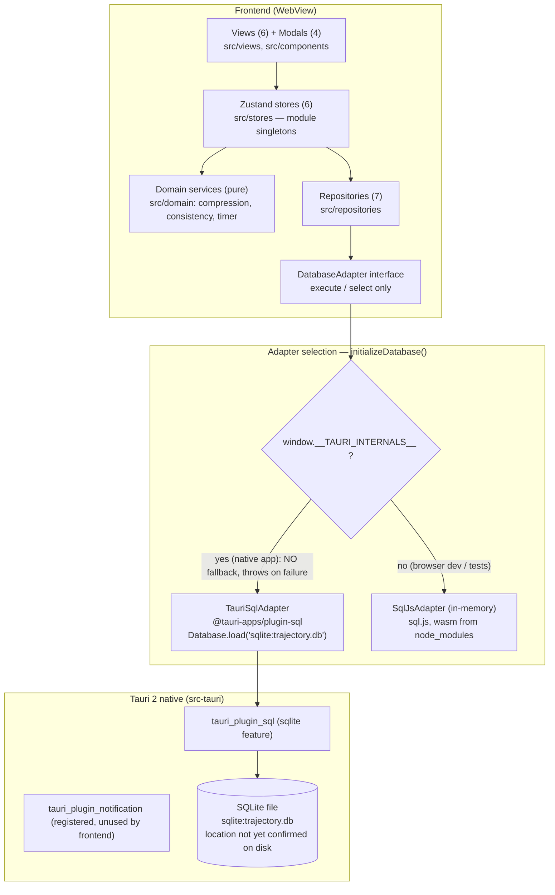
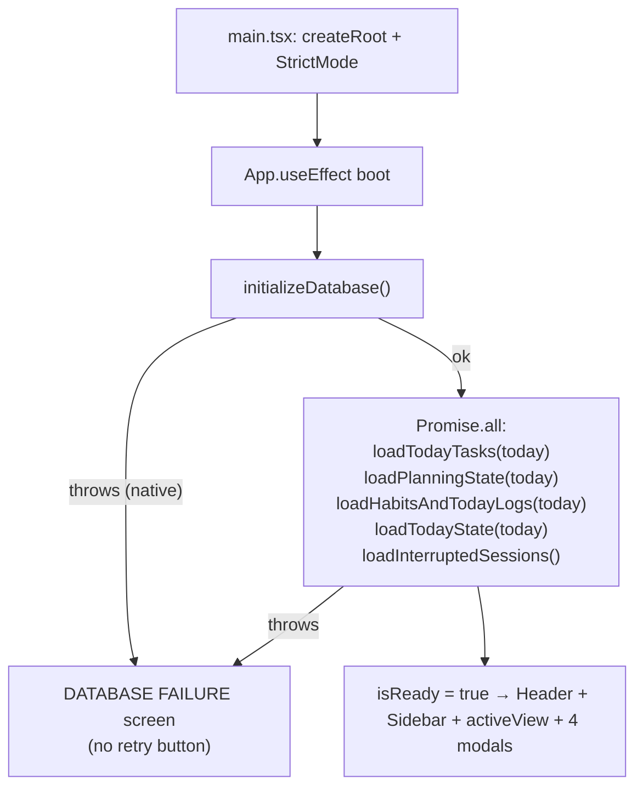
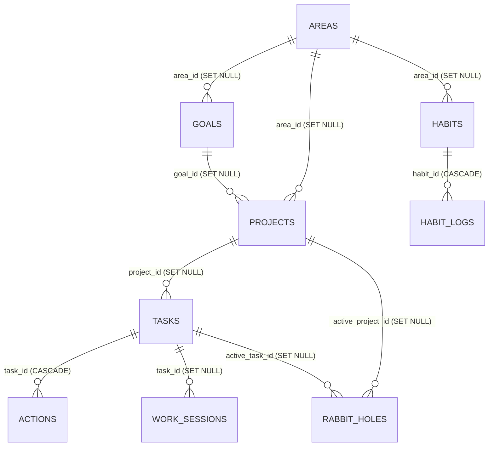
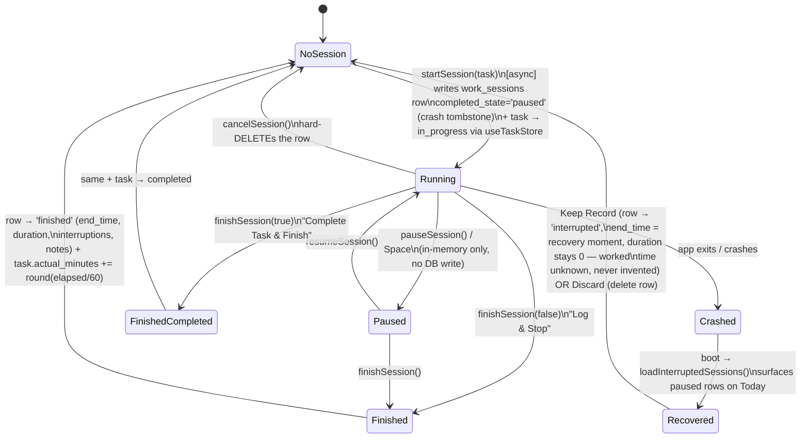

# Trajectory — Repository Knowledge Graph

> **Snapshot:** Phase 2A.5 (semantic stability) complete, 2026-09-06 (see `git log` for exact tip). Working tree clean, branch `main`, **no git remote configured**. Domain semantic contract: `docs/SEMANTICS.md` (authoritative).
> **Audience:** every agent (and human) about to modify this repository. Read §1–§4 before writing code; search §10 (gotcha index) before assuming anything works the way you expect.
> **Trust markers used throughout:** `[VERIFIED]` = proven against the real repo/environment · `[UNVERIFIED]` = plausible but never exercised · `[GOTCHA]` = trap that has already bitten or will · `[DEAD]` = exists but unreachable from any UI/test path.
> **Phase 2A note (2026-09-04):** planner board (Kanban), crash recovery, event log (migration 002), rabbit-hole backlog, review retrieval, Zod boundary validation, and local-day semantics landed. Resolved gotchas are marked FIXED below — read them as history.
> **This file is load-bearing. If you discover reality contradicting anything here, fix the code or fix this file — in the same commit (see §11 Maintenance protocol).

---

## 1. How to use this document

1. **Before planning work:** skim §2 (non-negotiables), §3 (architecture), §4 (entity graph).
2. **Before editing a subsystem:** find it in §6 (inventories) and check §10 (gotchas) for its tags.
3. **Before claiming done:** run the gates in §7 (runbook) and update §8 (verification ledger). Never substitute passing sql.js (in-memory) tests for native Tauri verification — that substitution is the original sin this project's Phase 1.5 exists to correct.
4. **After work:** update §8 and §10, bump the snapshot header, commit together with your change.

Companion documents, in order of authority:
- `.agents/rules/project.md` — master rulebook (always-on).
- `.agents/skills/{product-design,testing,tauri-engineering,database,ui-design}/SKILL.md` — domain doctrines. **`database/SKILL.md` and `ui-design/SKILL.md` are truncated/corrupt on disk** (both end mid-code-fence; database loses its timestamp conventions, ui-design loses everything after the Today-screen ASCII mockup).
- `.agents/workflows/{build-feature,review,release}.md` — process checklists. **`release.md` references `pnpm lint` which does not exist** (no lint/format tooling is installed).
- `docs/{PRODUCT,ARCHITECTURE,DATA_MODEL,ROADMAP}.md` — product/architecture specs; several claims are stale — see the trust map in §9.4 before citing them.
- `docs/SEMANTICS.md` — **the domain semantic contract** (authoritative for definitions)
- `walkthrough.md` — latest session-level status report (Phase 1.5 Day 1).

---

## 2. Product identity & non-negotiables

Trajectory is a **personal execution operating system**: its job is to answer *"What should I actually do right now?"* and to record behavioral truth without judgment.

**Axioms** (from `docs/PRODUCT.md` / `project.md`): execution over configuration · trajectory over perfection · **recovery over guilt** · behavioral data over productivity theatre · capture curiosity, don't suppress it · AI as augmentation, never a dependency.

**Hard prohibitions** — never implement:
- guilt-inducing language, productivity scores implying personal worth, destructive streak mechanics, notification spam.
- Consequences: habits use dual targets (normal + minimum viable) with weighted scoring (minimum = 0.6 credit, never a reset); compression copy is shame-free ("Pushed to Deferred (No Guilt)"); no punishment anywhere in UX.

**UX priority order:** 1. Today → 2. Current task → 3. Energy/state → 4. Habits → 5. Quick capture → 6. Review. One clear primary action per screen; calm/technical/understated tone; no gamification, gradients-on-everything, or motivational quotes.

**Stack mandates** (`project.md`): React + TypeScript + Vite + Tailwind + Zustand + Zod + Lucide; Tauri 2 + Rust for desktop; **SQLite via the official Tauri SQL plugin only**; "Do not implement native functionality through browser APIs when a Tauri-native solution exists"; "React components must not contain raw SQL queries"; layering `UI → Application state → Domain services → Persistence/Tauri APIs`.

**Known governance violation** `[GOTCHA]`: `src/views/ProjectsView.tsx` runs raw SQL via `getDatabase()` directly inside a React component — the only place this happens. It violates project.md, database skill, and review.md. Do not copy this pattern; it is recorded as tech debt in §9.3.

**Development gate** (10 steps, from project.md): inspect architecture → identify files → explain plan → check for reusable abstraction → smallest coherent version → format → typecheck → tests → run app when visual verification is relevant → report what changed and what was verified. There is **no formatter/linter installed**, so steps 6 is currently a no-op (`pnpm lint`/`format` scripts don't exist).

---

## 3. System architecture graph

### 3.1 Runtime layer graph `[VERIFIED]`



- `[GOTCHA]` Inside Tauri a DB failure **throws** (commit `39b506f`) → App renders the `DATABASE FAILURE` screen. Never reintroduce a silent in-memory fallback in native mode: it produced apps that "worked" while deleting all data on exit.
- `[DEAD]` notification plugin is registered in `lib.rs` and granted capabilities, but `@tauri-apps/plugin-notification` is imported nowhere in `src/`.
- `[VERIFIED]` No custom Rust commands exist; frontend↔native boundary is exclusively the SQL plugin.

### 3.2 Boot sequence `[VERIFIED]`



- `today = new Date().toISOString().split("T")[0]` — **UTC date**. `[GOTCHA]` see G-01.
- `[GOTCHA]` On store-load failure (non-native), boot catches, logs, and renders nothing but the spinner forever — only native DB failure has an error screen.

---

## 4. Domain entity graph

### 4.1 Persistence schema (13 tables) `[VERIFIED]` — source of truth: inline `MIGRATION_001` in `src/repositories/database.ts`



Key constraints and semantics:
- All PKs are UUID v4 TEXT; timestamps are UTC ISO-8601; day fields are `YYYY-MM-DD`.
- `tasks.status` CHECK: `inbox | planned | in_progress | completed | cancelled | deferred` (default `inbox`); `importance`: `critical | important | optional`; `cognitive_demand`: `deep | medium | shallow`; soft delete via `deleted_at`.
- `habit_logs`: **UNIQUE(habit_id, date)** — one row per habit per day; `target_met_status` CHECK: `none | minimum | normal | exceeded`.
- `work_sessions.completed_state` CHECK: `finished | interrupted | paused` — **`interrupted` is never written** `[DEAD]`; crash-safety uses `paused` (see §5.1).
- `daily_states`: no UNIQUE on `date`; upsert is lookup-based `[GOTCHA]`.
- `daily_reviews.date` UNIQUE (upsert safe).
- `rabbit_holes.status`: `captured | converted_task | converted_project | converted_idea | archived` — only `captured` is ever written `[GOTCHA]`.
- `_migrations(version PK, name, applied_at)` — currently exactly one row: `1, "001_initial_schema"`. `[GOTCHA]` the runner's DDL exists as **two copies**: inline `MIGRATION_001` string (runtime truth) and `src/repositories/migrations/001_initial_schema.sql` (documentation only, loaded by nothing). Edit both or edit only the string.

### 4.2 Entity coverage map (schema → repo → store → UI)

| Entity | Repository | Store | UI | Notes |
| --- | --- | --- | --- | --- |
| areas | **none** | — | ProjectsView, via projectRepository | 4 seeded at first run with fixed UUIDs `11111111-…`, `22222222-…`, `33333333-…`, `44444444-…` |
| goals | **none** | — | **none** `[DEAD]` | schema exists, fully unreachable |
| projects | ProjectRepository (read-only) | — | ProjectsView, Now cockpit (project context) | no create/edit path |
| tasks | TaskRepository | useTaskStore | Today, Planner, DeepWork, Projects, BrainDump(promote), NewTaskModal, CompressionModal | richest entity; soft delete wired to the Planner card (two-step confirm) since the planner-fixes pass; inbox reachable via the Planner Inbox column |
| actions | TaskRepository (3 methods) | **none** | **none** `[DEAD]` | entire subtask feature: schema + repo only |
| habits | HabitRepository | useHabitStore | TodayView, HabitsView (+HabitsView direct repo calls) | 4 seeded with fixed UUIDs `aaaaaaaa-…`, `bbbbbbbb-…`, `cccccccc-…`, `dddddddd-…` |
| habit_logs | HabitRepository | useHabitStore | TodayView ±15 steppers, HabitsView Min/Full/±10 | upsert per (habit,date) |
| work_sessions | WorkSessionRepository | useSessionStore | DeepWorkView | crash-safe write pattern (§5.1) |
| daily_states | StateRepository | useStateStore | TodayView 4 sliders | seeded defaults 6/6/4/5 `[GOTCHA]` comment says 5 |
| daily_reviews | ReviewRepository | useReviewStore | ReviewView (write) | **loadTodayReview never called** `[DEAD]` — reviews are write-only |
| rabbit_holes | RabbitHoleRepository | ReviewView CaptureBacklog (list + convert/dismiss) | RabbitHoleModal (capture) | capture + resolution loop complete since 2A (`16d7cf4`); conversion counts feed 2B facts |
| brain_dumps | BrainDumpRepository | **none** | BrainDumpView (direct repo) | single-slot document (latest row upserted) |
| planning_state | PlanningStateRepository | useTaskStore (owner) | TodayView objective + workload capacity | one row per local day; handoff from yesterday's review; NOW screen foundation |

---

## 5. State & data-flow graphs

### 5.1 Deep Work session lifecycle (crash-safe, commit `73796c5`) `[VERIFIED]`



- **Timing model (Phase 2A, `0ea099a`):** elapsed derives from wall-clock timestamps — `accumulatedSeconds` + `runningSinceMs` marker; `syncElapsed()` (a store-owned 1s interval) refreshes the display. Sessions keep truthful time across view unmounts and background throttling; finishing settles duration from the clock, not from tick counts.
- `duration_seconds` counts only running time; `start_time`/`end_time` are wall-clock brackets (they include paused gaps). `[GOTCHA]` these two disagree by design — documented here, nowhere else.
- `setNowForTesting(fn)` is the exported clock seam in `useSessionStore` — used by all 17 session-lifecycle tests.
- `startSession` while a session is active is a **silent no-op**, but TodayView still navigates to DeepWorkView (which shows the old session) `[GOTCHA]`.
- Auto-selection rule: completing the active task promotes the first `planned` (else `in_progress`) task to active.

### 5.2 Task status flow `[VERIFIED]`

```mermaid
graph LR
    Inbox["inbox\n(unchecked 'Schedule for Today')"] -- "NO PATH OUT [DEAD]" --> X["invisible in every view"]
    Planned["planned\n(checked 'Schedule for Today')"] --> InProg["in_progress\n(startSession / manual)"]
    InProg --> Completed["completed\n(completed_at set)"]
    InProg --> Completed2["completed via finishSession(true)"]
    Planned --> Deferred["deferred\n(compressPlan only)"]
    Deferred --> Planned: "Planner drag (moveTaskStatus)\nreschedules for today [GOTCHA G-37]"
    Completed --> Terminal["terminal"]
    Cancelled["cancelled\n(never written by UI) [DEAD]"]
```

- `compressPlan` persists only `planned → deferred` transitions and then reloads today's list. Deferred tasks keep their `scheduled_date`, so the SQL still returns them; they disappear because views filter on `planned`/`in_progress`.

### 5.3 Compression algorithm (`compressDayPlan(tasks, availableMinutes)`) — pure, deterministic, non-mutating `[VERIFIED]`

1. Partition by status: `completed` / `in_progress` / `planned`. **`inbox`, `cancelled`, `deferred` inputs are silently dropped from the result** (neither kept nor deferred) `[GOTCHA]`.
2. `committedMinutes` = Σ over completed+in_progress of (`actual_minutes` if > 0 else `estimated_minutes`); `remainingBudget = max(0, available − committed)`.
3. **Critical planned tasks: always kept** (budget may go negative).
4. Important planned tasks: sorted by `order_index` asc, then `estimated_minutes` asc; kept if `est ≤ remainingBudget || remainingBudget > 0` — `[GOTCHA]` the `|| remainingBudget > 0` clause keeps the **first** important task even when it overruns the remaining budget (drives budget negative); later ones must fit.
5. Optional planned tasks: kept only if `est ≤ remainingBudget && remainingBudget > 0` (strict).
6. `totalPlannedMinutes` = Σ kept estimates; `fitsWithinBudget = total ≤ available`; `freedMinutes` = Σ deferred estimates.

Store persistence (`useTaskStore.compressPlan`): marks each deferred task via `updateTask(id, {status:"deferred"})`, reloads, returns `{freedMinutes, deferredCount}`. **No task is created or deleted; completed tasks untouched** — the core invariant "compression changes the plan, not history".

### 5.4 Habit logging & consistency `[VERIFIED]`

- Every log value overwrites the single `(habit_id, date)` row (manual upsert under the UNIQUE index).
- `evaluateTargetStatus(value, normal, minimum)`: `≤0` → none · `< minimum` → none · `[minimum, normal)` → minimum · `[normal, normal×1.5]` → normal · `> normal×1.5` → exceeded. (Exactly 1.5× is still "normal".)
- `calculateRollingConsistency(statuses, windowDays=14)`: score = `normalDays×1.0 + minimumDays×0.6`; percent = `min(100, round(score / max(windowDays, statuses.length) × 100))`; labels: ≥75 "Resilient Trajectory", ≥45 "Minimum Viable Continuity", else "Low Momentum".
- HabitsView uses **7-day** windows (`CONSISTENCY_WINDOW_DAYS = 7`), real history via `HabitRepository.getRecentStatuses(habitId, endDate, days)` — **an unlogged day counts as `none` (missed)**, computed with UTC day math.

### 5.5 Cross-store edges — exactly two, both `useSessionStore → useTaskStore` `[VERIFIED]`

1. `startSession` → `useTaskStore.getState().updateTaskStatus(task.id, "in_progress")`
2. `finishSession(true)` → `useTaskStore.getState().updateTaskStatus(task.id, "completed")`

Everything else is strictly layered. Views that bypass stores and call repositories directly (deliberate but noteworthy): HabitsView (`createHabit`, `getRecentStatuses`), BrainDumpView (`getLatestBrainDump`, `saveBrainDump`), RabbitHoleModal (`createRabbitHole`), ProjectsView (now via `projectRepository`/`taskRepository` — fixed 2A.5).

### 5.6 Today's-date pattern `[GOTCHA]`

FIXED in Phase 2A: all "today" computation flows through `src/domain/time/date.ts` (`todayLocal()` — LOCAL calendar day; `addDays` — UTC-safe date-string math; `dayFromTodayLocal`). Stored timestamps remain UTC ISO-8601. The NOW stage added `useDayRollover`: when the local day changes under an open app, today-keyed stores reload. Tests use the real date (TodayView.test) or explicit fixtures; `habitRepository.getRecentStatuses` day-string iteration is timezone-safe by design.

---

## 6. Component inventory

### 6.1 Zustand stores (`src/stores/`)

All stores are module singletons with module-level repo instances; no persist middleware; no selectors (views destructure whole stores → re-render on any change).

| Store | State (defaults) | Actions | Test seams |
| --- | --- | --- | --- |
| `useTaskStore` | `tasks: []`, `boardTasks: []`, `activeTaskId: null`, `primaryObjective: string | null` (persisted per local day), `availableMinutes: 420` (fallback until planning state loads), `isLoading` | `loadTodayTasks(date)` (auto-selects active: first in_progress, else first planned), `loadPlanningState(date)` (persists + review→morning handoff), `createTask(params)` (status = scheduled_date ? planned : **inbox**; `source` controls the event), `updateTaskStatus(id, status)` (settles live session on completed/deferred/inbox; sets completed_at; promotes next active), `moveTaskStatus(id, status, source?)` (Planner moves; → Planned schedules today when unscheduled; settles too), `updateTaskDetails(id, details)`, `loadBoard()`, `setActiveTask`, `setPrimaryObjective(text|null, date)` (write-through; null clears), `setAvailableMinutes(mins, date)` (write-through), `compressPlan(date)`, `deleteTask(id)` (soft delete via `softDeleteTask`; refuses `{ok:false, reason:"active-session"}` when the task owns the live session; logs `task.deleted` {title}; prunes tasks/boardTasks/activeTaskId then reloads the board) | real in-memory DB via `setDatabase` |
| `useSessionStore` | `activeSession: ActiveSession | null` (`{sessionId, taskId, taskTitle, startTime, accumulatedSeconds, runningSinceMs, elapsedSeconds, isRunning, interruptionCount, notes}`), `interruptedSessions: WorkSession[]` | `startSession(task)` **async**, `pauseSession`, `resumeSession`, `syncElapsed()`, `recordInterruption(note?)`, `updateNotes`, `finishSession(completeTask=false)` **async**, `cancelSession` **async**, `loadInterruptedSessions()`, `keepInterruptedRecord(id)`, `discardInterruptedSession(id)`, `resumeInterruptedSession(id)` (adopts the paused row in place) | `setNowForTesting(fn)` clock seam (used by the session tests) |
| `useHabitStore` | `habits: []`, `todayLogs: Record<habitId, HabitLog>` | `loadHabitsAndTodayLogs(date)`, `logHabitValue(habitId, date, value, notes?)` (computes target status via domain, persists, merges) | — |
| `useStateStore` | `currentState: DailyState | null` | `loadTodayState(date)` (seeds 6/6/4/5 if absent), `updateMetric(date, metric, value)` (upsert) | — |
| `useReviewStore` | `todayReview`, `recentReviews: []` | `saveReview(review)` (used by ReviewView), `loadTodayReview(date)` `[DEAD never called]` | — |
| `useUIStore` | `activeView: "today"|"planner"|"deep_work"|"habits"|"brain_dump"|"review"|"projects"`, `activeMode: ExecutionMode` (`"deep_work"` default), `reviewTab: "daily"|"weekly"` (Phase 2B), 4 modal flags | pure setters: `setActiveView`, `setActiveMode`, `setReviewTab`, `set{RabbitHole,NewTask,Compression,CommandPalette}ModalOpen`, `openTaskEditor`/`closeTaskEditor` | — |

Planning state (`primaryObjective: string | null`, `availableMinutes`) persists in `planning_state` per local day (NOW stage). `loadPlanningState(date)` applies the review→morning handoff; `setPrimaryObjective`/`setAvailableMinutes` write through and log `planning.*` events. ReviewView no longer "primes" anything in memory.

### 6.2 Repositories (`src/repositories/`)

| Repo | Methods (semantics) | Dead / notes |
| --- | --- | --- |
| `TaskRepository` | `getAllTasks(includeDeleted=false)` (Planner board; ProjectsView) · `getTodayTasks(date)` — `deleted_at IS NULL AND (scheduled_date = ? OR (status='in_progress' AND scheduled_date IS NULL))`, ordered importance→order_index→created_at DESC · `getTaskById` (Zod-parsed) · `createTask` (Zod-parsed; defaults: important/medium/inbox/30min; returns constructed object) · `updateTask` (dynamic SET, always bumps updated_at) · `softDeleteTask` (WIRED: Planner card delete, two-step confirm) | ADDED 2B: `getTasksCompletedInRange(startIso, endIso)` (completed_at range, UTC instants derived from local days). REMOVED in 2A.5: `getInboxTasks`, actions CRUD (goals/actions documented as future) |
| `HabitRepository` | `getAllHabits` (int→bool is_archived) · `createHabit` · `getLogsForDate` · `getLogsForRange(start, end)` · `getRecentStatuses(habitId, endDate, days)` (per-day statuses via addDays, unlogged = "none") · `logHabit` (ATOMIC upsert on UNIQUE(habit,date), Zod-parsed) | — |
| `WorkSessionRepository` | `createSession` (Zod-parsed) · `updateSession` (dynamic SET, no updated_at column) · `deleteSession` (hard DELETE) · `getPausedSessions` (recovery read, Zod-parsed) | ADDED 2B: `getSessionsInRange(startIso, endIso)` (start_time range). Also `getRecentSessions`, `getSessionsForTask`. REMOVED in 2A.5: `getTodayTotalDuration` (dead + local-day-vs-UTC LIKE mismatch) |
| `StateRepository` | `getDailyState` (latest by logged_at) · `saveDailyState` (lookup upsert) | no UNIQUE(date) in schema |
| `ReviewRepository` | `getDailyReview` · `saveDailyReview` (lookup upsert on UNIQUE date) · `getRecentReviews(7)` | — |
| `RabbitHoleRepository` | `createRabbitHole` (always status 'captured') · `getAllRabbitHoles(status?)` · `updateStatus(id, status, convertedId?)` — reachable via ReviewView CaptureBacklog (convert → Inbox task / dismiss → archived); real statuses feed 2B rabbit-hole facts | — |
| `EventLogRepository` | `record` (fire-and-forget append) · `getRecent(limit)` · `getByEntity(id)` · 2B read model: `getByDateRange(startIso, endIso, {eventTypes?})` (indexed, bounded), `getByType(type, limit)`, `getLatestSnapshotsForRange(startIso, endIso)` (latest planning.day_snapshot per local date) | append-only inviolable; payload schemas in `src/domain/events/payloads.ts` parsed defensively (malformed → warning, never throw) |
| `BrainDumpRepository` | `getLatestBrainDump` · `saveBrainDump` (upsert latest row → single-slot doc) | — |
| `database.ts` | `initializeDatabase` (Tauri hard-fail / browser sql.js) · `createInMemoryDatabase` (loads wasm from node_modules under Node) · `runMigrations` (version-checked, idempotent DDL) · `seedDefaultsIfEmpty` (4 areas + 4 habits, fixed UUIDs) · `getDatabase`/`setDatabase` (test seam) | `MIGRATION_001` inline vs `.sql` file duplication `[GOTCHA]`; runner splits migration on `";"` — safe today, breaks if a migration ever contains a semicolon inside a string literal |

### 6.3 Views (exact literal strings — use these in tests)

| View | Key literals / structure | Flows |
| --- | --- | --- |
| `TodayView` | Objective banner `"Primary Objective For Today"` (click-to-edit, Enter/Save; empty-state literal `"Click to set today's primary objective"`; right side shows `" <Weekday> · <local date> "` from `todayLocal()` — no bare "Date" placeholder) · NOW cockpit `"NOW — Active Focus"` with `Complete` + `Enter Deep Work` (or empty-state `"No active task selected. Pick a planned task below to start execution."` + `Create New Task`) · sections `"Must-Do — Critical Leverage ({n})"` (only if non-empty), `"Should-Do — High Leverage ({n})"` (always; header has `Add Task`), `"Optional — If Capacity Permits ({n})"`, `"Completed Today ({n})"` · right column: `WorkloadBar` (`"Daily Workload"`, `"{p}% CAPACITY"`, overload banner + `Compress Day Plan`), sliders `"Energy"/"Mental Clarity"/"Stress"/"Social Battery"` (fallbacks 6/6/4/5), `"Habit Trajectory"` with ±15 steppers | NOW console (2A.5): cockpit runs sessions INLINE — Start/Pause/Resume/Complete/Defer/Edit + Focus link; Complete/Defer settle the live session via moveTaskStatus/updateTaskStatus; quick-capture bar (Enter → Inbox); NEXT card; recovery banner (Resume/Keep Record/Discard); plannedLoad via `plannedLoadMinutes` |
| `PlannerView` | Header `"Planner — Task Board"`, `"{n} Tasks Across The Pipeline"`, `"+ New Task"` · 5 columns (Inbox/Planned/In Progress/Completed/Deferred, `flex-1 min-w-64`) with empty-state texts · card: title, ImportanceBadge/CognitiveBadge, `{n}m`, `due {date}`, `logged {n}m`, pencil edit, Trash2 delete | drag = HTML5 DnD on column roots (`text/plain` transport, `dropEffect:"move"`, G-56); double-click opens editor; delete = two-step confirm: first click morphs to `"Delete?"` (reverts ~3s), second executes; disabled + tooltip `"Finish the session before deleting"` while the card owns the live session |
| `DeepWorkView` | Empty: `"No Active Deep Work Session"`, `Back to Today Plan` · Active: `"Deep Work Execution Mode"`, `"CURRENT FOCUS OBJECTIVE"`, mono timer, `Target: {n}m` + delta label, `Pause Session`/`Resume Session`, `Complete Task & Finish`, `Log & Stop`, `Capture Tangent (R)`, `"Interruptions ({n})"` + `+ Log Interruption` (input placeholder `"Brief reason: phone call, colleague, slack..."`), Session Scratchpad textarea | the display interval lives in the session store (view-agnostic); estimated fallback 45m |
| `HabitsView` | `"Habits & Behavioral Continuity"`, H1 `"Minimum Viable Day Architecture"`, `New Habit` → modal (`"Create New Habit"`) · per-habit card: consistency badge (7-day real history), `Min ({min})` / `Full ({norm})` quick logs, ±10 stepper | creates habit via direct repo call, then reloads store |
| `ProjectsView` | `"Hierarchy & Execution Architecture"`, `"Life Area → Goal → Project → Task → Action"`, `"{n} Areas • {n} Projects • {n} Tasks"`, left `"Life Areas"` (projects nested), right `"Tasks in Focus ({n})"` + `Show All Tasks` | reads via `projectRepository`/`taskRepository` (layering fixed 2A.5); re-fetches everything on selection change `[GOTCHA]` |
| `BrainDumpView` | `"Brain Dump & Cognitive Canvas"`, `"Messy thoughts, ambiguous ideas, fragments. Zero structure required."`, `Save`, selection bar `"Selected:"` + `Promote to Task` | promote → `createTask({importance: important, demand: medium, scheduled_date: today})` → lands in today's planned |
| `ReviewView` | Tab switcher (Daily Shutdown / Weekly Review; `useUIStore.reviewTab`), then daily content: `"Evening Shutdown (90-Second Review)"`, `"Daily Reflection & Closeout"`, snapshot cards, questions `"1. What drained your energy or derailed execution?"` / `"2. What gave you energy or created high flow?"` / `"3. What is the single primary objective for tomorrow?"` / `"Optional Notes / Epiphanies"`, button `"Complete Shutdown (90s)"` → after save `"Shutdown Recorded — Rest Well"`, navigates home after 1200ms | computes stats from task store (completed count; totalWorkMinutes = Σ actual‖estimated of completed) |
| `WeeklyReview` | Phase 2B weekly tab: week navigation (default = last completed week; `"week in progress"` label on current; Next disabled on current), 4 sections (This Week / Planning / Execution / Patterns) rendered from `buildWeeklyBehaviorFacts` (`src/services/behaviorService.ts`); honest empty/sparse states; no charts, no advice |

### 6.4 Components & modals

| Component | Behavior worth knowing |
| --- | --- |
| `Modal` | Escape-to-close via window keydown; **no backdrop-click close**; uses `animate-fadeIn` which is undefined `[GOTCHA]` |
| `Button` | variants `primary|secondary|ghost|danger` → `.btn-*` CSS classes; sizes sm/md/lg |
| `Badge` / `ImportanceBadge` / `CognitiveBadge` / `StatusBadge` | status label map: in_progress→"ACTIVE"; optional badge uses nonexistent `zinc-850` `[GOTCHA]` |
| `DualTargetProgressBar` | scale `max(normal×1.2, current, min×2)`; zinc→cyan (≥min)→emerald (≥normal); tick marks with tooltips |
| `WorkloadBar` | percent = committed/max(1,available); overload section only when committed > available |
| `Slider` | 1–10 range, accent colors |
| `Header` | mode chips deep_work/admin/learning/physical/shutdown; **clicking deep_work also navigates, shutdown → review view; others only set mode**; quick actions Commands(Ctrl+K), Rabbit Hole(R), Dump(D), New Task(N) |
| `Sidebar` | 6 nav items ("Hierarchy" = projects); "ACTIVE" pulsing badge on Deep Work when session exists |
| `CommandPaletteModal` | 11 commands: navigation (`"Go to Today"`, `"Go to Planner Board"`, `"Go to Deep Work Cockpit"`, `"Go to Habits & Consistency"`, `"Go to Life Areas & Projects"`, `"Go to Brain Dump Scratchpad"`, `"Start Daily Shutdown Review"`, `"Open Weekly Review"`) + `"Create New Task (N)"`, `"Capture Rabbit Hole (R)"`, `"Compress Overloaded Day Plan"`; substring filter; **mouse-only — no arrow-key navigation** |
| `CompressionModal` | **recomputes `compressDayPlan` on every render** (not memoized); Apply disabled when nothing to defer; `"Pushed to Deferred (No Guilt)"` |
| `NewTaskModal` | fields title/description/importance/demand/estimate; checkbox `"Schedule for Today"` **default true**; unchecked ⇒ inbox ⇒ invisible `[GOTCHA]` |
| `RabbitHoleModal` | provenance from active task; **Ctrl/Cmd+Enter submits**; capture only — listing/resolution lives in ReviewView's CaptureBacklog |

### 6.5 Keyboard shortcuts (`useKeyboardShortcuts`)

| Key | Action | Notes |
| --- | --- | --- |
| Ctrl/Cmd+K | toggle command palette | works even while typing (checked before input guard) |
| N | New Task modal | inert while typing in input/textarea/contentEditable |
| R | Rabbit Hole modal | same guard |
| D | navigate to brain_dump view | same guard |
| Space | pause/resume active session | only when a session exists; otherwise normal scroll |
| Esc | close modal | handled inside `Modal` |
| Ctrl/Cmd+Enter | submit rabbit hole | handled inside `RabbitHoleModal` |
| Enter | save objective / interruption note | per-view handlers |

`[GOTCHA]` hotkeys fire regardless of open modals (except the typing guard) — N while CompressionModal is open opens NewTaskModal on top.

### 6.6 Styling

- Tailwind palette extensions: `canvas.{base,subtle,muted,border,borderStrong}`, `text.{primary,secondary,muted}`, `trajectory.{cyan,blue,emerald,amber,rose,purple}`; fonts Inter / JetBrains Mono (Google Fonts in index.html); `darkMode: "class"`; app is dark-only.
- Custom CSS classes in `index.css`: `.btn-primary/secondary/ghost/danger` (colors + flex layout only — padding/typography come exclusively from Button's sm/md/lg map, fixed `4906dc5`), plus **`[DEAD]`** `.input-base`, `.badge-metric`, `.panel-surface` (defined, unused).
- FIXED (`ff62d6c`): `animate-fadeIn` and `zinc-750/850` shades are defined in tailwind.config.js. Responsive: `xl:`/`2xl:` breakpoints introduced in `c6b6039` — view containers raise caps at 2xl (Today/Habits/Projects → 7xl, BrainDump → 6xl, DeepWork → 5xl, Review → 4xl), Habits grid gains `2xl:grid-cols-3`, and Planner columns are `flex-1 min-w-64` so the board fills wide windows.
- `[DEAD]` dependencies installed but never imported: `recharts`, `clsx`, `tailwind-merge`, `@tauri-apps/plugin-notification`.

---

## 7. Environment & operations runbook `[VERIFIED unless noted]`

### 7.1 Commands

| Command | What it does / proves | Time |
| --- | --- | --- |
| `pnpm dev` | Vite dev server, **port 1420, strictPort** — fails if port is taken (kill stray vite first) | ~1s |
| `pnpm typecheck` | `tsc --noEmit`; strict mode + noUnusedLocals/Parameters | ~5s |
| `pnpm test` | Vitest run (jsdom); 167 tests / 19 suites, integration-style against real in-memory SQLite via `createInMemoryDatabase()` + `setDatabase()` | ~60s (jsdom setup dominates) |
| `pnpm build` | `tsc && vite build` → `dist/` (~287KB JS / 85KB gzip) | ~5s |
| `pnpm tauri dev` | Native desktop app; cold Rust compile **~15 min** (432 crates), incremental after | — |
| `pnpm tauri build` | NSIS installer + exe (bundle config in place); **never run yet** | unknown `[UNVERIFIED]` |

### 7.2 Toolchain (Windows)

cargo/rustc **1.98.0** (stable-x86_64-pc-windows-msvc) · VS Community 2026 (linker OK) · WebView2 **152** · Tauri CLI **2.11.4** · pnpm **11.24** · Node **22.20** · **no sqlite3 CLI on PATH** (plugin uses bundled sqlx sqlite). `src-tauri/target/`, `src-tauri/gen/`, `dist/`, `*.db` are gitignored; `src-tauri/Cargo.lock` and full desktop icon set (`src-tauri/icons/`, incl. `icon.ico`) are committed.

### 7.3 Git conventions

Small, coherent commits; checkpoint style (`chore:`/`feat:`/`fix:`/`test:`/`docs:`); never force-push; no remote configured (push deliberately pending user's URL); preserve user work in the tree; keep DBs/build artifacts out of Git. Current history (7 commits): `8b5a609` docs baseline → `1fed554` MVP → `871fc7c` old walkthrough preserved → `39b506f` native env verified → `73796c5` crash-safe sessions → `7cffbbb` real habit consistency → `0c2db9b` Phase 1.5 Day-1 walkthrough.

### 7.4 Test-writing conventions

- Pattern: `beforeEach(async () => { const db = await createInMemoryDatabase(); setDatabase(db); ... })` — real SQL, no mocks anywhere (`vi.mock` has zero uses).
- Component tests: RTL, assert on the exact literal strings in §6.3; stores manipulated via `useXStore.getState()` / `setState`.
- Setup stubs: `ResizeObserver`, `window.matchMedia` (`src/test/setup.ts`).
- `[GOTCHA]` TodayView.test loads stores for hardcoded `"2026-09-03"` but the view renders the real today.

---

## 8. Verification ledger

| Gate | Status | Evidence / commit | Date |
| --- | --- | --- | --- |
| `pnpm typecheck` zero errors | ✅ VERIFIED | every commit; last run at Phase 1.5 completion | 2026-09-04 |
| `pnpm test` | ✅ VERIFIED | 137/137 (16 suites): Phase 2A matrix + NOW stage + 2A.5 invariant/recovery/repair tests (`4a5fcbb`…`9b651a4`) | 2026-09-06 |
| `pnpm build` production bundle | ✅ VERIFIED | ~287KB JS / 85KB gzip | 2026-09-04 |
| `pnpm tauri dev` native window | ✅ VERIFIED | cold compile 14m59s, native window launched (`39b506f`) | 2026-09-04 |
| Native persistence loop | ✅ VERIFIED | task created in native app survived close + relaunch; DB inspected directly | 2026-09-04 |
| Production SQLite path | ✅ VERIFIED | `%APPDATA%\com.trajectory.app\trajectory.db`, WAL mode, checkpointed on close; session/accrual/rabbit-hole rows confirmed by direct read | 2026-09-04 |
| Migration gates | ✅ VERIFIED | fresh-install + idempotent re-run unit-tested; single migration, no manufactured history | 2026-09-04 |
| Deep work session semantics | ✅ VERIFIED natively | finished row: wall-clock bracket 191s vs `duration_seconds` 148 (paused gap excluded); `actual_minutes` accrued | 2026-09-04 |
| Rabbit-hole capture during session | ✅ VERIFIED natively | row persisted with provenance; session uninterrupted | 2026-09-04 |
| Deterministic dev seed | ✅ VERIFIED | `497ea8f`, 8 tests incl. determinism + refuse-guard | 2026-09-04 |
| Manual product exercise (native) | ✅ VERIFIED | deep work → capture → pause/resume → finish; overload 150% → compression preview; task creation with custom duration | 2026-09-04 |
| `pnpm tauri build` (NSIS) | ✅ VERIFIED | `Trajectory_0.1.0_x64-setup.exe` (3.1MB) + release `trajectory.exe` (12.5MB); release binary smoke-booted | 2026-09-04 |
| Crash recovery UI | ✅ VERIFIED | `0ea099a`: interrupted rows surfaced on Today; Keep Record finalizes 'interrupted', Discard deletes; 3 recovery tests | 2026-09-04 |
| Planner board / inbox visibility / deferred recovery | ✅ VERIFIED | `3b5e6e5`: 5 store tests incl. Kanban↔Today consistency; native Planner verified on screen | 2026-09-04 |
| `pnpm test` (Phase 2B) | ✅ VERIFIED | 167/167 (19 suites): aggregation/edge/threshold/UI + concurrent-boot snapshot regression (`eb0d26d`) | 2026-09-06 |
| Planner drag & delete (browser) | ✅ VERIFIED | 6 RTL tests (178/178): drop moves status (repo-read asserted), G-37 reschedule regression, two-step delete + soft-delete row + task.deleted event, live-session guard | 2026-09-07 |
| Planner drag & delete (native, WAL) | ✅ VERIFIED | pending native pass — see walkthrough update | 2026-09-07 |
| Native 2B verification (CDP-assisted, background-safe) | ✅ VERIFIED | `eb0d26d`: migrations v1→v4 + integrity ok on the live DB; `planning.day_snapshot` written at boot with dedupe — reload adds 0 rows (write-queue + boot-order fix); WeeklyReview renders/navigates in the running app; `buildWeeklyBehaviorFacts` returns real facts from live data. Technique: WebView2 `--remote-debugging-port=9223` + CDP `Runtime.evaluate` (background-safe, no focus steal) | 2026-09-06 |
| UI polish pass (V-1..V-11, visual only) | ✅ VERIFIED | `Button` gains `action` size + per-size gap map; NOW action row unified to ghost buttons (measured 6px icon-label gap on all five, `getBoundingClientRect`); cockpit title `break-words`+tooltip; banner date `Sun · 2026-09-06`; objective empty-state literal `Click to set today's primary objective`; meta card stacks below 2xl (row form overflowed at 1280-1536); right-column cards unified p-4/gap-3; weekly toggle→header 32px→24px; week nav 32px buttons `disabled:opacity-40`; sidebar gap-1.5. V-1b: typing-burst guard on single-letter hotkeys (n/r/d) with 4 regression tests — 'ish the NOW execution console' in user data is the pre-fix artifact (NOT rewritten). CDP-verified at 1280/1536/2560 (emulated viewport; display logical width is 1280), zero console errors. | 2026-09-06 |

**Standing rule:** passing sql.js/browser tests never counts as native verification. Native claims require the native app.

---

## 9. Known gaps & decision log

### 9.1 Phase status
- **Phase 1.5 — COMPLETE (2026-09-04)**: native environment, persistence loop + DB path, migration gates, crash-safe sessions, critical-path tests, dev seed, manual exercise, NSIS build, docs sync.
- **Phase 2A — COMPLETE (2026-09-04)**: temporal correctness (`476d3ab`), session robustness + crash recovery (`0ea099a`), event_log instrumentation (`192c21d`), Kanban planner + inbox/deferred recovery (`3b5e6e5`), rabbit-hole backlog + review retrieval (`16d7cf4`), Zod boundary validation (`90da102`), UI fixes (`ff62d6c`), and a StrictMode boot-race fix (`cd2e4f6`) discovered during final native verification (UNIQUE constraint on `_migrations.version` when boot runs twice concurrently — fixed with a singleton init promise + INSERT OR IGNORE, regression-tested). 105 tests. Decision log in ROADMAP.md Phase 2A. README added (`c3ae3f7`).
- **NOW stage — COMPLETE (2026-09-06)**: planning-state persistence + tomorrow handoff (`4a5fcbb`), metrics module (`f02b049`), the Now console (`c899e32`), rollover + defer command + failure-case tests (`8da27ae`). 131 tests. Native loop verified: objective → start → pause → close → relaunch → recovery banner → Resume adoption, all event-logged. Decision log in ROADMAP NOW stage (D stays Brain Dump; inline start; handoff at load).
- **Phase 2A.5 — COMPLETE (2026-09-06)**: semantic stability pass. Fixed: Planner-drag session stranding (settle-on-transition via `settleActiveSessionForTask`), finishSession double-invoke double-counting actual_minutes (synchronous state nulling), duplicate session.paused/resumed/recovery events (transition guards), persisted rows made authoritative (syncElapsed ≥30s duration writes; resume adopts recorded duration; Keep Record keeps synced duration), ReviewView metric duplication → `domain/metrics.ts`, second day-engine in getRecentStatuses → `addDays`, `getTodayTotalDuration` deleted (dead + UTC/LIKE-wrong), validation wired at ALL DB→UI boundaries incl. new PlanningStateSchema, daily_states UNIQUE(date) (migration 004), objective clearing now persists null, baseline contradiction 6/6/4/5-vs-5/5/5/5 unified, dead code removed (getInboxTasks, actions CRUD, 3 CSS classes, recharts/clsx/tailwind-merge), agent infra repaired (release.md lint, build-feature formatter, database/ui-design SKILL truncations). Semantic contract: `docs/SEMANTICS.md`. Native verification (real SQLite): migrations v1→v4 applied; daily_states duplicate rows repaired by migration 004 (one row per date confirmed); stale recovery tombstone discarded natively; PRAGMA integrity_check ok. [VERIFIED]
- **Phase 2B — COMPLETE (2026-09-06)**: behavioural synthesis truth layer. Event-log read model + typed defensive payloads (`dc1ae90`); cancel-logged-before-delete with duration payload, `task.completed`/`task.deferred`/`compression.applied` events; `planning.day_snapshot` plan-of-record with signature dedupe (StrictMode double-boot race found natively and fixed via serialized write queue + planning-state-first boot order, `eb0d26d`); `src/domain/behavior/*` pure modules (estimates/planning/sessions/deferrals/habits/rabbitHoles/stateAssociations/patterns with explicit `PATTERN_THRESHOLDS`); `WeeklyBehaviorFacts` + `behaviorService` with provenance + coverage warnings; Weekly Review UI tab + `Open Weekly Review` palette command. Strictly descriptive (SEMANTICS.md §9.6): no LLM/prediction/ranking/causal language; `supported` confidence reserved for longitudinal data; habit metric is resilience not streaks. 167 tests. [VERIFIED]
- **Remaining known debt**: Planner refetch-on-selection-change; goals/actions schema-ahead-of-UI; daily_states intra-day history not kept (day-level granularity is the record); notification plugin registered Rust-side only; no lint/format tooling; foreign_keys pragma unverified on the native build (sqlx default assumed); no git remote.
- **Next**: notifications/tray or Phase 3 (prediction/LLM narration) per ROADMAP.md — the 2B `WeeklyBehaviorFacts` layer is the intended substrate for any future LLM narration.

### 9.2 Product limitations (known, deferred)
- No in-session "abandon" button in DeepWorkView (cancel exists in the store; crash-recovery Discard covers the post-restart case).
- Actions/subtasks and goals: schema-only, no UI (documented as future — do not activate casually).
- `daily_states` keeps only day-level granularity: intra-day slider history is not recorded (the row is the record; 2B uses day-level associations by design).
- `foreign_keys` pragma enforcement on the native build is unverified (sqlx default assumed; no pragma found in src-tauri).
- ~~event_log read APIs have no UI~~ RESOLVED in 2B: read model + Weekly Review UI; the event log is now an analytics input with typed, defensively-parsed payloads.

### 9.3 Governance-vs-code violations (recorded, not yet fixed)
- `ProjectsView.tsx` raw SQL in a React component (violates project.md / database skill / review.md).
- `release.md` requires `pnpm lint`; no lint/format tooling exists.
- ~~ARCHITECTURE.md's "30-second flush" claim~~ FIXED: replaced with the real crash-safety + wall-clock timing design during Phase 1.5/2A doc syncs.
- `database/SKILL.md` and `ui-design/SKILL.md` are truncated mid-file; testing skill §14 references timestamp conventions that no longer exist in database skill.

### 9.4 Docs trust map
| Doc | Verdict |
| --- | --- |
| `DATA_MODEL.md` DDL | ✅ ACCURATE (matches schema; omits IF NOT EXISTS) |
| `PRODUCT.md` | ✅ mostly accurate; deep-work field names slightly stale (`actual_duration_seconds`/`completed_flag` vs real `duration_seconds`/`completed_state`) |
| `ARCHITECTURE.md` | ⚠️ STALE/FALSE in places: "React 19" (real: 18.3), `src-tauri/migrations/` path (real: `src/repositories/migrations/`, and runtime uses the inline copy), 30s flush claim (false), directory layout missing ProjectsView/ProgressBar, lists nonexistent Input/Tooltip/planner//state/ |
| `ROADMAP.md` | ✅ current through Phase 2B (1.5 / NOW / 2A / 2A.5 / 2B sections with decision logs; M14/M15 annotated as delivered) |
| `walkthrough.md` | ✅ current (Phase 1.5 Day 1) |

---

## 10. Gotcha index (search by tag)

| ID | Tag | Gotcha |
| --- | --- | --- |
| G-01 | date | FIXED in Phase 2A (`476d3ab`): all “today” computation flows through `src/domain/time/date.ts` (LOCAL calendar day); timestamps stay UTC. Keep using the util — do not reintroduce inline `toISOString().split` for day keys |
| G-02 | date | PARTIALLY FIXED: TodayView.test uses the real current date; some fixtures (session store) use explicit dates deliberately — new date-sensitive tests should follow the real-date pattern |
| G-03 | db | Inside Tauri, DB failure throws (no fallback). Never restore silent in-memory fallback in native mode |
| G-04 | db | `MIGRATION_001` inline string is runtime truth; `migrations/001_initial_schema.sql` is a documentation copy — edit both or despair |
| G-05 | db | Migration runner splits SQL on `";"` — safe until a migration embeds a semicolon in a string literal |
| G-06 | db | `seedDefaultsIfEmpty` uses fixed UUIDs (`11111111-…` areas, `aaaaaaaa-…` habits) — seeds are identity-stable by design; don't regenerate IDs |
| G-07 | sessions | `startSession` while active is a silent no-op but TodayView still navigates (shows the OLD session) |
| G-08 | sessions | FIXED in Phase 2A (`0ea099a`): the refresh interval lives in the store and elapsed time derives from wall-clock timestamps — view unmounts and throttling cannot distort recorded durations |
| G-09 | sessions | `duration_seconds` (running-only) ≠ `end_time − start_time` (wall clock incl. pauses) — intentional, undocumented elsewhere |
| G-10 | sessions | `completed_state='interrupted'` is never written; crash rows stay `'paused'` forever — nothing reads/cleans them |
| G-11 | sessions | PARTIALLY FIXED: crash-recovery Discard and explicit `cancelSession` exist; there is still no in-session “abandon” button in DeepWorkView |
| G-12 | tasks | FIXED in Phase 2A (`3b5e6e5`): inbox tasks are visible in the Planner’s Inbox column; `moveTaskStatus` is the routing path |
| G-13 | tasks | FIXED in Phase 2A (`3b5e6e5`): Deferred column in the Planner; dragging back to Planned reschedules for today |
| G-14 | compression | inbox/cancelled/deferred inputs are silently dropped from compression output (neither kept nor deferred) |
| G-15 | compression | First important task is kept even when it overruns remaining budget (`|| remainingBudget > 0` branch); later importants must fit |
| G-16 | compression | Critical tasks are kept unconditionally — budget may go negative |
| G-17 | metrics | FIXED in NOW stage (`f02b049`): explicit metrics module `domain/metrics.ts` (plannedLoad / remainingLoad / loggedWork / remainingEstimate); views use named metrics; compression's committed-minutes stays internal to the spec'd algorithm |
| G-18 | habits | Unlogged day = missed (`getRecentStatuses` fills "none"); HabitsView window is 7 days vs domain default 14 |
| G-19 | habits | Habit value is a single upserted row/day — logging 15 then 60 replaces, never accumulates |
| G-20 | state | `useStateStore` comment says "baseline 5/10" but seeds 6/6/4/5; `updateMetric` null-fallback is 5/5/5/5 |
| G-21 | persistence | FIXED in NOW stage (`4a5fcbb`): `primaryObjective` + `availableMinutes` persist in `planning_state` per local day, and the review→morning objective handoff is real (logged, idempotent) |
| G-22 | reviews | FIXED in Phase 2A (`16d7cf4`): ReviewView prefills from today’s saved review and lists Recent Reflections |
| G-23 | validation | Zod schemas are type-inference only; zero runtime validation; DB rows are trusted casts (only int→bool mappings exist) |
| G-24 | ui | FIXED in Phase 2A (`ff62d6c`): fadeIn keyframes + zinc-750/850 shades defined in tailwind.config.js |
| G-25 | ui | Modals: no backdrop-click close; Escape via window listener; single-letter hotkeys fire even with modals open (typing guard only) |
| G-26 | ui | FIXED in Phase 2A (`ff62d6c`): ↑/↓ highlight + Enter executes + hover sync |
| G-27 | ui | PARTIALLY FIXED in NOW stage (`c899e32`): ProjectsView reads through `projectRepository`/`taskRepository` (raw-SQL violation resolved); the refetch-on-selection-change inefficiency remains |
| G-28 | dead | SUPERSEDED — most entries resolved or deliberately kept through 2A/2A.5 (rabbit-hole repo + review loading now used; cancelSession reachable via recovery; Planner uses getAllTasks). Current dead-code state: goals/actions schema-only (future), `softDeleteTask` (kept, no UI), notification plugin (Rust-side), dead CSS classes removed in 2A.5 |
| G-29 | deps | Unused installed deps: `recharts`, `clsx`, `tailwind-merge`, `@tauri-apps/plugin-notification` |
| G-30 | env | Port 1420 is strictPort — a stray vite process breaks `pnpm tauri dev` (kill it first) |
| G-31 | env | tsconfig includes nonexistent `vitest.config.ts` (harmless dead reference) |
| G-32 | docs | Governance files: `database/SKILL.md` + `ui-design/SKILL.md` truncated on disk; `release.md` demands a nonexistent `pnpm lint` |
| G-33 | db | The native DB runs in **WAL mode**: recent writes sit in `trajectory.db-wal` until a checkpoint (committed on clean close). Reading the main file with sql.js/`sqlite3` while the app runs shows stale data — that is the reader's limitation, not data loss |
| G-34 | product | Day compression keeps the first important task even when the plan stays overloaded ("always preserve momentum"), so the modal can show "-0m freed" and nothing to defer on a >100% day. Confirmed in the native UI 2026-09-04; recorded as a deliberate spec — changing it is a product decision, not a bug fix |
| G-35 | ui | An oversized "should-do" task shown under "Preserved Work (Priority & Leverage)" is the compression overrun branch at work (see G-15/G-34) — misleading label candidates for Phase 2 copy polish |
| G-36 | db | Migration 002 added `event_log`; the native DB upgrades v1→v2 on first launch after this change. Coverage: rolled-back-v1 upgrade test in database.test.ts |
| G-37 | planner | Dragging a task into Planned schedules it for today when unscheduled (documented decision) — column moves are NOT purely a status change for Planned |
| G-38 | sessions | A session row is `completed_state='paused'` while ACTIVE; reloading the app mid-session therefore surfaces your own live session in the crash-recovery banner — truthfully, because the reload did kill it |
| G-39 | planner | Completed tasks with past scheduled_date do not appear on Today’s Completed list (day-filtered); they remain visible on the Planner’s Completed column |
| G-40 | ui | FIXED (`4906dc5`): `.btn-*` classes duplicated px/py/text with Button's size map — effective sizing resolved by CSS output order; sizing is now single-source in Button.tsx, and icon spans are flex-centered (baseline offset fixed) |
| G-41 | db | Migration 003 added `planning_state` (one row per local day: primary_objective, available_minutes) — the persistence behind the Now screen; native DB upgraded v2→v3 on first launch, verified |
| G-42 | sessions | Deferring or completing the active task while its session runs settles the session FIRST (finish, not cancel) — no orphaned timers on non-active tasks; both cockpit and palette paths |
| G-43 | sessions | Resuming an interrupted session ADOPTS the paused row in place (same id, no duplicate); refusing adoption while a session is live |
| G-44 | ui | UI verification on this machine: the display raster (2880→1280 at 0.444) makes small/dark text unreadable in screenshots — verify via DevTools (`checkVisibility()`, `getBoundingClientRect`, `el.click()` dispatches real React events) instead of pixel-click loops |
| G-45 | sessions | FIXED (2A.5): status transitions out of active work now settle the live session via `settleActiveSessionForTask` — previously only cockpit/palette paths did; Planner drag stranded sessions on completed tasks |
| G-46 | sessions | FIXED (2A.5): finishSession double-invoke double-counted actual_minutes — live state is nulled synchronously before awaits; re-entrance impossible |
| G-47 | events | FIXED (2A.5): session.paused/resumed fired outside their transition guards (duplicates on double Space); recovery actions now membership-guarded. Rule: log only real transitions |
| G-48 | sessions | FIXED (2A.5): persisted rows are authoritative — syncElapsed writes duration at a >=30s cadence; resume adopts recorded duration; crash loses <=30s |
| G-49 | db | FIXED (2A.5): migration 004 adds UNIQUE(date) to daily_states (last per-day table without it); migration v4 verified in tests |
| G-50 | validation | FIXED (2A.5): every DB->UI boundary validates with its Zod schema incl. new PlanningStateSchema; event_log deliberately excluded (log lines, not UI inputs) |
| G-52 | concurrency | FIXED (`eb0d26d`): StrictMode double-boot raced day-snapshot check-then-write into duplicate `planning.day_snapshot` rows (found natively via CDP). Writes now serialize through a module-level queue and boot loads planning state BEFORE today's tasks. Never add a check-then-write around the event log without the queue |
| G-54 | ui | Icon+text gap lives in Button.tsx's size map (sm/action gap-1.5, md/lg gap-2) — `.btn-*` CSS no longer sets gap. Ghost action-row buttons use `size="action"`; never add per-instance icon margins (G-40 + V-2) |
| G-56 | dnd | Planner drops REQUIRE `preventDefault` on the column root's `onDragOver` (plus `dropEffect="move"`) — without it the browser shows the not-allowed cursor and `onDrop` never fires. Handlers live on the COLUMN ROOT (empty columns stay valid targets). Natively, WebView2 also needs `dragDropEnabled: false` in tauri.conf.json or it hijacks HTML5 DnD. Never "simplify" either away |
| G-55 | ux | Single-letter hotkeys (n/r/d/space) fire only on an ISOLATED keypress (500ms burst guard, `useKeyboardShortcuts`). Typing with no input focused still loses those characters — recovering them needs a type-anywhere capture feature (deferred). 'ish the NOW execution console' in the DB is the pre-guard artifact |
| G-53 | tooling | UI verification on this machine without stealing focus: launch with `WEBVIEW2_ADDITIONAL_BROWSER_ARGUMENTS="--remote-debugging-port=9223"`, then drive `Runtime.evaluate` over CDP (native Node 22 `WebSocket` global; response value lives at `result.result.value`). High-DPI screenshots are unreadable — prefer CDP DOM reads (see verification ledger 2026-09-06) |
| G-51 | docs | `docs/SEMANTICS.md` is the authoritative domain semantic contract (local day, planning state, task status, session lifecycle, metrics, event catalogue, current-vs-history). Update it in the same commit as any semantic change |

---

## 11. Maintenance protocol

1. **Update triggers** — modify this file in the same commit when you: add/change a store action, repo method, migration, view/section, shortcut, command, capability/permission, script, or dependency; run a verification gate (§8); discover a new gotcha; or find this document contradicting reality.
2. **Snapshot header** — bump the commit hash + date at the top whenever §8 or §10 changes materially.
3. **Gotchas are append-only** — add new IDs (G-nn); never delete an entry; if one is fixed, mark it `FIXED in <commit>` with one line explaining the resolution (history is the project's memory).
4. **Verification ledger is truth-stamped** — only flip ❌→✅ with the evidence (command output, commit hash, date) actually in hand; "it compiles" is not verification.
5. **Keep §4.2 coverage map honest** — when you wire up a `[DEAD]` feature (e.g. build rabbit-hole conversion UI), move the entity's row and remove the tag in the same commit.
6. **When docs conflict** — `.agents/rules/project.md` and the skills win over `docs/*.md`; this graph wins over both when it is fresher (it is stamped; they are not). If you fix a stale doc claim, update §9.4.
