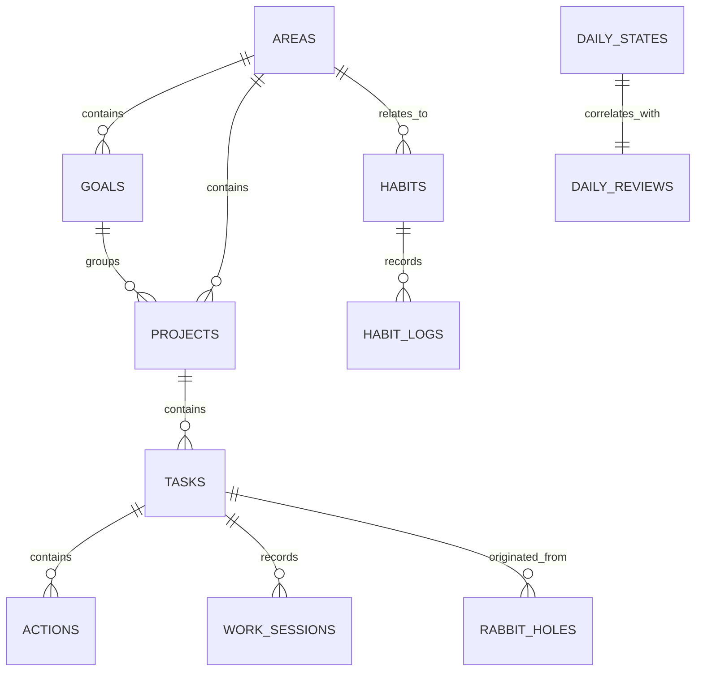

# Trajectory — Database Schema & Data Model

## 1. Persistence Principles

Trajectory uses **SQLite** as its single source of persistent truth. The schema adheres to the following principles:

1. **UUID Primary Keys**: All entity IDs are generated as RFC-4122 v4 UUID strings (`TEXT PRIMARY KEY`), allowing safe optimistic UI generation and offline operation.
2. **UTC ISO-8601 Timestamps**: All timestamps are stored in UTC format (`YYYY-MM-DDTHH:MM:SS.SSSZ`). Local date representations (`YYYY-MM-DD`) are maintained for daily aggregations.
3. **Historical Truth Preservation**: Replanning, day compression, or project reorganization never destroys completed task records, work sessions, or habit logs.
4. **Soft Deletion for User Work**: Tasks and habits utilize soft deletion (`deleted_at IS NULL`) so historical references in past reviews and work sessions remain valid.
5. **Foreign Key Integrity**: Foreign keys enforce relationships, with explicit `ON DELETE SET NULL` or `RESTRICT` rules to safeguard execution history.

---

## 2. Entity-Relationship Diagram



---

## 3. SQL Tables & Schema Specifications

### `areas` (Life Areas)
High-level spheres of responsibility.
```sql
CREATE TABLE areas (
    id TEXT PRIMARY KEY,
    name TEXT NOT NULL,
    description TEXT,
    color TEXT NOT NULL DEFAULT '#3b82f6',
    order_index INTEGER NOT NULL DEFAULT 0,
    created_at TEXT NOT NULL,
    updated_at TEXT NOT NULL
);
```

### `goals`
Target outcomes within a life area.
```sql
CREATE TABLE goals (
    id TEXT PRIMARY KEY,
    area_id TEXT REFERENCES areas(id) ON DELETE SET NULL,
    title TEXT NOT NULL,
    description TEXT,
    target_date TEXT,
    status TEXT NOT NULL CHECK(status IN ('active', 'achieved', 'paused', 'abandoned')) DEFAULT 'active',
    order_index INTEGER NOT NULL DEFAULT 0,
    created_at TEXT NOT NULL,
    updated_at TEXT NOT NULL
);
CREATE INDEX idx_goals_area ON goals(area_id);
```

### `projects`
Discrete initiatives with definable endpoints.
```sql
CREATE TABLE projects (
    id TEXT PRIMARY KEY,
    goal_id TEXT REFERENCES goals(id) ON DELETE SET NULL,
    area_id TEXT REFERENCES areas(id) ON DELETE SET NULL,
    title TEXT NOT NULL,
    description TEXT,
    status TEXT NOT NULL CHECK(status IN ('active', 'completed', 'on_hold', 'archived')) DEFAULT 'active',
    order_index INTEGER NOT NULL DEFAULT 0,
    created_at TEXT NOT NULL,
    updated_at TEXT NOT NULL
);
CREATE INDEX idx_projects_goal ON projects(goal_id);
CREATE INDEX idx_projects_area ON projects(area_id);
```

### `tasks`
Atomic, actionable units of work.
```sql
CREATE TABLE tasks (
    id TEXT PRIMARY KEY,
    project_id TEXT REFERENCES projects(id) ON DELETE SET NULL,
    title TEXT NOT NULL,
    description TEXT,
    importance TEXT NOT NULL CHECK(importance IN ('critical', 'important', 'optional')) DEFAULT 'important',
    cognitive_demand TEXT NOT NULL CHECK(cognitive_demand IN ('deep', 'medium', 'shallow')) DEFAULT 'medium',
    status TEXT NOT NULL CHECK(status IN ('inbox', 'planned', 'in_progress', 'completed', 'cancelled', 'deferred')) DEFAULT 'inbox',
    estimated_minutes INTEGER NOT NULL DEFAULT 30,
    actual_minutes INTEGER NOT NULL DEFAULT 0,
    scheduled_date TEXT, -- YYYY-MM-DD
    due_date TEXT,       -- ISO timestamp
    completed_at TEXT,   -- ISO timestamp
    order_index INTEGER NOT NULL DEFAULT 0,
    created_at TEXT NOT NULL,
    updated_at TEXT NOT NULL,
    deleted_at TEXT
);
CREATE INDEX idx_tasks_status_date ON tasks(status, scheduled_date);
CREATE INDEX idx_tasks_project ON tasks(project_id);
```

### `actions`
Micro-steps / checklist items within a task.
```sql
CREATE TABLE actions (
    id TEXT PRIMARY KEY,
    task_id TEXT NOT NULL REFERENCES tasks(id) ON DELETE CASCADE,
    title TEXT NOT NULL,
    is_completed INTEGER NOT NULL DEFAULT 0,
    order_index INTEGER NOT NULL DEFAULT 0,
    created_at TEXT NOT NULL,
    completed_at TEXT
);
CREATE INDEX idx_actions_task ON actions(task_id);
```

### `habits`
Continuous behavioral patterns with Dual Target (Normal + Minimum).
```sql
CREATE TABLE habits (
    id TEXT PRIMARY KEY,
    area_id TEXT REFERENCES areas(id) ON DELETE SET NULL,
    title TEXT NOT NULL,
    description TEXT,
    unit TEXT NOT NULL DEFAULT 'minutes', -- 'minutes', 'pages', 'reps', 'count'
    normal_target REAL NOT NULL,
    minimum_target REAL NOT NULL,
    order_index INTEGER NOT NULL DEFAULT 0,
    is_archived INTEGER NOT NULL DEFAULT 0,
    created_at TEXT NOT NULL,
    updated_at TEXT NOT NULL
);
```

### `habit_logs`
Daily measurements of habit execution.
```sql
CREATE TABLE habit_logs (
    id TEXT PRIMARY KEY,
    habit_id TEXT NOT NULL REFERENCES habits(id) ON DELETE CASCADE,
    date TEXT NOT NULL, -- YYYY-MM-DD
    value REAL NOT NULL DEFAULT 0,
    target_met_status TEXT NOT NULL CHECK(target_met_status IN ('none', 'minimum', 'normal', 'exceeded')),
    notes TEXT,
    logged_at TEXT NOT NULL
);
CREATE UNIQUE INDEX idx_habit_logs_unique_day ON habit_logs(habit_id, date);
CREATE INDEX idx_habit_logs_date ON habit_logs(date);
```

### `work_sessions`
Recorded deep work sessions.
```sql
CREATE TABLE work_sessions (
    id TEXT PRIMARY KEY,
    task_id TEXT REFERENCES tasks(id) ON DELETE SET NULL,
    start_time TEXT NOT NULL,
    end_time TEXT NOT NULL,
    duration_seconds INTEGER NOT NULL,
    interruption_count INTEGER NOT NULL DEFAULT 0,
    completed_state TEXT NOT NULL CHECK(completed_state IN ('finished', 'interrupted', 'paused')),
    notes TEXT,
    created_at TEXT NOT NULL
);
CREATE INDEX idx_work_sessions_task ON work_sessions(task_id);
CREATE INDEX idx_work_sessions_start ON work_sessions(start_time);
```

### `daily_states`
Lightweight state tracking (1–10 subjective scale).
```sql
CREATE TABLE daily_states (
    id TEXT PRIMARY KEY,
    date TEXT NOT NULL, -- YYYY-MM-DD
    energy INTEGER CHECK(energy BETWEEN 1 AND 10),
    clarity INTEGER CHECK(clarity BETWEEN 1 AND 10),
    stress INTEGER CHECK(stress BETWEEN 1 AND 10),
    social_battery INTEGER CHECK(social_battery BETWEEN 1 AND 10),
    notes TEXT,
    logged_at TEXT NOT NULL
);
CREATE INDEX idx_daily_states_date ON daily_states(date);
```

### `daily_reviews`
End-of-day 90-second reflection.
```sql
CREATE TABLE daily_reviews (
    id TEXT PRIMARY KEY,
    date TEXT NOT NULL UNIQUE, -- YYYY-MM-DD
    completed_task_count INTEGER NOT NULL DEFAULT 0,
    total_work_minutes INTEGER NOT NULL DEFAULT 0,
    energy_drains TEXT,
    energy_boosts TEXT,
    tomorrow_objective TEXT,
    reflection_notes TEXT,
    created_at TEXT NOT NULL
);
```

### `rabbit_holes`
Instant curiosity capture without derailing deep work.
```sql
CREATE TABLE rabbit_holes (
    id TEXT PRIMARY KEY,
    active_task_id TEXT REFERENCES tasks(id) ON DELETE SET NULL,
    active_project_id TEXT REFERENCES projects(id) ON DELETE SET NULL,
    raw_text TEXT NOT NULL,
    status TEXT NOT NULL CHECK(status IN ('captured', 'converted_task', 'converted_project', 'converted_idea', 'archived')) DEFAULT 'captured',
    converted_id TEXT,
    created_at TEXT NOT NULL,
    converted_at TEXT
);
CREATE INDEX idx_rabbit_holes_status ON rabbit_holes(status);
```

### `brain_dumps`
Unstructured persistent scratchpad.
```sql
CREATE TABLE brain_dumps (
    id TEXT PRIMARY KEY,
    content TEXT NOT NULL,
    created_at TEXT NOT NULL,
    updated_at TEXT NOT NULL
);
```

### `_migrations`
Schema migration history.
```sql
CREATE TABLE _migrations (
    version INTEGER PRIMARY KEY,
    name TEXT NOT NULL,
    applied_at TEXT NOT NULL
);
```
