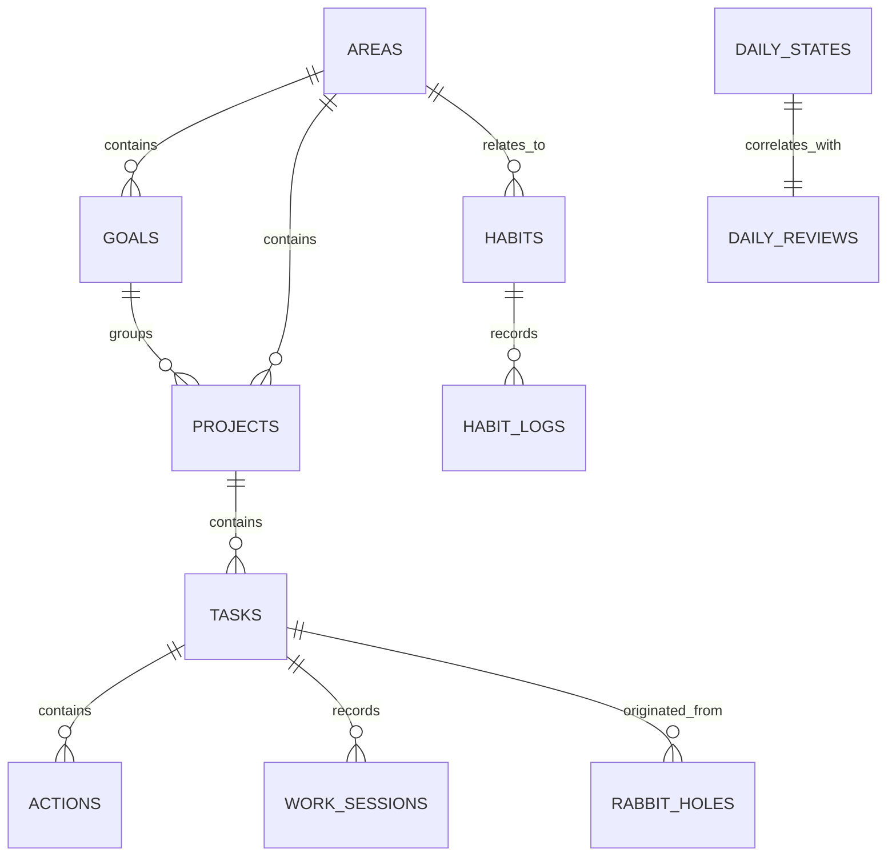

# Trajectory — Database Schema & Data Model

## 1. Persistence Principles

Trajectory uses **SQLite** as its single source of persistent truth. The schema adheres to the following principles:

1. **UUID Primary Keys**: All entity IDs are generated as RFC-4122 v4 UUID strings (`TEXT PRIMARY KEY`), allowing safe optimistic UI generation and offline operation.
2. **UTC ISO-8601 Timestamps**: All timestamps are stored in UTC format (`YYYY-MM-DDTHH:MM:SS.SSSZ`). Local date representations (`YYYY-MM-DD`) are maintained for daily aggregations.
3. **Historical Truth Preservation**: Replanning, day compression, or project reorganization never destroys completed task records, work sessions, or habit logs.
4. **Soft Deletion for User Work**: Tasks and habits utilize soft deletion (`deleted_at IS NULL`) so historical references in past reviews and work sessions remain valid.
5. **Foreign Key Integrity**: Foreign keys enforce relationships, with explicit `ON DELETE SET NULL` or `RESTRICT` rules to safeguard execution history.

---

## 2. Entity-Relationship Diagram



---

## 3. SQL Tables & Schema Specifications

### `areas` (Life Areas)
High-level spheres of responsibility.
```sql
CREATE TABLE areas (
    id TEXT PRIMARY KEY,
    name TEXT NOT NULL,
    description TEXT,
    color TEXT NOT NULL DEFAULT '#3b82f6',
    order_index INTEGER NOT NULL DEFAULT 0,
    created_at TEXT NOT NULL,
    updated_at TEXT NOT NULL
);
```

### `goals`
Target outcomes within a life area.
```sql
CREATE TABLE goals (
    id TEXT PRIMARY KEY,
    area_id TEXT REFERENCES areas(id) ON DELETE SET NULL,
    title TEXT NOT NULL,
    description TEXT,
    target_date TEXT,
    status TEXT NOT NULL CHECK(status IN ('active', 'achieved', 'paused', 'abandoned')) DEFAULT 'active',
    order_index INTEGER NOT NULL DEFAULT 0,
    created_at TEXT NOT NULL,
    updated_at TEXT NOT NULL
);
CREATE INDEX idx_goals_area ON goals(area_id);
```

### `projects`
Discrete initiatives with definable endpoints.
```sql
CREATE TABLE projects (
    id TEXT PRIMARY KEY,
    goal_id TEXT REFERENCES goals(id) ON DELETE SET NULL,
    area_id TEXT REFERENCES areas(id) ON DELETE SET NULL,
    title TEXT NOT NULL,
    description TEXT,
    status TEXT NOT NULL CHECK(status IN ('active', 'completed', 'on_hold', 'archived')) DEFAULT 'active',
    order_index INTEGER NOT NULL DEFAULT 0,
    created_at TEXT NOT NULL,
    updated_at TEXT NOT NULL
);
CREATE INDEX idx_projects_goal ON projects(goal_id);
CREATE INDEX idx_projects_area ON projects(area_id);
```

### `tasks`
Atomic, actionable units of work.
```sql
CREATE TABLE tasks (
    id TEXT PRIMARY KEY,
    project_id TEXT REFERENCES projects(id) ON DELETE SET NULL,
    title TEXT NOT NULL,
    description TEXT,
    importance TEXT NOT NULL CHECK(importance IN ('critical', 'important', 'optional')) DEFAULT 'important',
    cognitive_demand TEXT NOT NULL CHECK(cognitive_demand IN ('deep', 'medium', 'shallow')) DEFAULT 'medium',
    status TEXT NOT NULL CHECK(status IN ('inbox', 'planned', 'in_progress', 'completed', 'cancelled', 'deferred')) DEFAULT 'inbox',
    estimated_minutes INTEGER NOT NULL DEFAULT 30,
    actual_minutes INTEGER NOT NULL DEFAULT 0,
    scheduled_date TEXT, -- YYYY-MM-DD
    due_date TEXT,       -- ISO timestamp
    completed_at TEXT,   -- ISO timestamp
    order_index INTEGER NOT NULL DEFAULT 0,
    created_at TEXT NOT NULL,
    updated_at TEXT NOT NULL,
    deleted_at TEXT
);
CREATE INDEX idx_tasks_status_date ON tasks(status, scheduled_date);
CREATE INDEX idx_tasks_project ON tasks(project_id);
```

### `actions`
Micro-steps / checklist items within a task.
```sql
CREATE TABLE actions (
    id TEXT PRIMARY KEY,
    task_id TEXT NOT NULL REFERENCES tasks(id) ON DELETE CASCADE,
    title TEXT NOT NULL,
    is_completed INTEGER NOT NULL DEFAULT 0,
    order_index INTEGER NOT NULL DEFAULT 0,
    created_at TEXT NOT NULL,
    completed_at TEXT
);
CREATE INDEX idx_actions_task ON actions(task_id);
```

### `habits`
Continuous behavioral patterns with Dual Target (Normal + Minimum).
```sql
CREATE TABLE habits (
    id TEXT PRIMARY KEY,
    area_id TEXT REFERENCES areas(id) ON DELETE SET NULL,
    title TEXT NOT NULL,
    description TEXT,
    unit TEXT NOT NULL DEFAULT 'minutes', -- 'minutes', 'pages', 'reps', 'count'
    normal_target REAL NOT NULL,
    minimum_target REAL NOT NULL,
    order_index INTEGER NOT NULL DEFAULT 0,
    is_archived INTEGER NOT NULL DEFAULT 0,
    created_at TEXT NOT NULL,
    updated_at TEXT NOT NULL
);
```

### `habit_logs`
Daily measurements of habit execution.
```sql
CREATE TABLE habit_logs (
    id TEXT PRIMARY KEY,
    habit_id TEXT NOT NULL REFERENCES habits(id) ON DELETE CASCADE,
    date TEXT NOT NULL, -- YYYY-MM-DD
    value REAL NOT NULL DEFAULT 0,
    target_met_status TEXT NOT NULL CHECK(target_met_status IN ('none', 'minimum', 'normal', 'exceeded')),
    notes TEXT,
    logged_at TEXT NOT NULL
);
CREATE UNIQUE INDEX idx_habit_logs_unique_day ON habit_logs(habit_id, date);
CREATE INDEX idx_habit_logs_date ON habit_logs(date);
```

### `work_sessions`
Recorded deep work sessions.
```sql
CREATE TABLE work_sessions (
    id TEXT PRIMARY KEY,
    task_id TEXT REFERENCES tasks(id) ON DELETE SET NULL,
    start_time TEXT NOT NULL,
    end_time TEXT NOT NULL,
    duration_seconds INTEGER NOT NULL,
    interruption_count INTEGER NOT NULL DEFAULT 0,
    completed_state TEXT NOT NULL CHECK(completed_state IN ('finished', 'interrupted', 'paused')),
    notes TEXT,
    created_at TEXT NOT NULL
);
CREATE INDEX idx_work_sessions_task ON work_sessions(task_id);
CREATE INDEX idx_work_sessions_start ON work_sessions(start_time);
```

### `daily_states`
Lightweight state tracking (1–10 subjective scale).
```sql
CREATE TABLE daily_states (
    id TEXT PRIMARY KEY,
    date TEXT NOT NULL, -- YYYY-MM-DD
    energy INTEGER CHECK(energy BETWEEN 1 AND 10),
    clarity INTEGER CHECK(clarity BETWEEN 1 AND 10),
    stress INTEGER CHECK(stress BETWEEN 1 AND 10),
    social_battery INTEGER CHECK(social_battery BETWEEN 1 AND 10),
    notes TEXT,
    logged_at TEXT NOT NULL
);
CREATE INDEX idx_daily_states_date ON daily_states(date);
```

### `daily_reviews`
End-of-day 90-second reflection.
```sql
CREATE TABLE daily_reviews (
    id TEXT PRIMARY KEY,
    date TEXT NOT NULL UNIQUE, -- YYYY-MM-DD
    completed_task_count INTEGER NOT NULL DEFAULT 0,
    total_work_minutes INTEGER NOT NULL DEFAULT 0,
    energy_drains TEXT,
    energy_boosts TEXT,
    tomorrow_objective TEXT,
    reflection_notes TEXT,
    created_at TEXT NOT NULL
);
```

### `rabbit_holes`
Instant curiosity capture without derailing deep work.
```sql
CREATE TABLE rabbit_holes (
    id TEXT PRIMARY KEY,
    active_task_id TEXT REFERENCES tasks(id) ON DELETE SET NULL,
    active_project_id TEXT REFERENCES projects(id) ON DELETE SET NULL,
    raw_text TEXT NOT NULL,
    status TEXT NOT NULL CHECK(status IN ('captured', 'converted_task', 'converted_project', 'converted_idea', 'archived')) DEFAULT 'captured',
    converted_id TEXT,
    created_at TEXT NOT NULL,
    converted_at TEXT
);
CREATE INDEX idx_rabbit_holes_status ON rabbit_holes(status);
```

### `brain_dumps`
Unstructured persistent scratchpad.
```sql
CREATE TABLE brain_dumps (
    id TEXT PRIMARY KEY,
    content TEXT NOT NULL,
    created_at TEXT NOT NULL,
    updated_at TEXT NOT NULL
);
```

### `_migrations`
Schema migration history.
```sql
CREATE TABLE _migrations (
    version INTEGER PRIMARY KEY,
    name TEXT NOT NULL,
    applied_at TEXT NOT NULL
);
```

---

## 4. Implemented Persistence Semantics

How the schema above is actually used by the repository layer (verified against `src/repositories/*`):

- **Timestamps.** All stored timestamps are UTC ISO-8601 strings (`new Date().toISOString()`). Day-granularity fields (`scheduled_date`, `habit_logs.date`, `daily_states.date`, `daily_reviews.date`) are `YYYY-MM-DD`. The application currently derives "today" independently in several places via `new Date().toISOString().split("T")[0]` (UTC calendar day) — there is no shared date utility yet.
- **Identity.** All primary keys are UUID v4 strings generated client-side (`crypto.randomUUID()`). Default seeds (4 areas, 4 habits) and the development seed use fixed UUIDs so identities are stable across machines.
- **Creation returns constructed objects.** `createTask`, `createSession`, `logHabit`, `createHabit` insert the row and return the object they constructed — they do not re-read from the database.
- **Upserts by lookup.** Entities with natural day keys are upserted by SELECT-then-UPDATE/INSERT: `habit_logs` (unique index on `habit_id, date` backs this), `daily_states` (no unique constraint on `date` — latest row by `logged_at` wins on read), `daily_reviews` (`date` UNIQUE), `brain_dumps` (single-document: latest row is updated in place).
- **Deletion.** Tasks use soft delete (`deleted_at`); every repository read filters it. Work sessions and habit logs hard-delete only via explicit calls (`deleteSession` for cancellation; habit logs are never deleted, only overwritten). The schema's `ON DELETE SET NULL` / `CASCADE` rules mean removing a parent never destroys historical child records.
- **Deferral.** Day compression persists `planned → deferred` status transitions only. Deferred tasks keep their `scheduled_date`, remain in the database, and can be rescheduled back to `planned` — compression changes the plan, never history, and never deletes.
- **Work session lifecycle.** A session row is written at start with `completed_state: 'paused'` (crash tombstone), promoted to `'finished'` on completion, or hard-deleted on cancellation. `duration_seconds` accumulates running time only (paused gaps excluded); `start_time`/`end_time` are the wall-clock brackets and intentionally differ from the duration. The `'interrupted'` enum value is reserved but not yet written by any flow.
- **Validation status.** Zod schemas in `src/domain/models/types.ts` are the source of inferred types; runtime `.parse()` validation at repository boundaries is not yet enforced — rows are trusted casts today.

## 5. Event Log (Migration 002)

```sql
CREATE TABLE event_log (
    id TEXT PRIMARY KEY,
    event_type TEXT NOT NULL,      -- e.g. 'task.status_changed', 'session.finished'
    entity_type TEXT NOT NULL,     -- 'task' | 'session' | 'habit' | 'daily_review' | 'rabbit_hole'
    entity_id TEXT,
    payload TEXT,                  -- JSON details (from/to status, duration, counts)
    created_at TEXT NOT NULL
);
```

Append-only behavioural record. `work_sessions.completed_state = 'interrupted'` is now a written state: crash-recovery finalization marks paused rows as interrupted with `end_time` at the recovery moment and `duration_seconds` 0 (unknown worked time is never invented).

## 6. Day Semantics (updated)

Daily aggregation keys (`scheduled_date`, `habit_logs.date`, `daily_states.date`, `daily_reviews.date`) follow the **user's local calendar day**, computed through `src/domain/time/date.ts` (`todayLocal()`, `dayFromTodayLocal()`). Stored timestamps remain UTC ISO-8601. Before Phase 2A, "today" was computed as the UTC day in nine independent places, which lagged the user's calendar day by up to one timezone offset. Date-only arithmetic (`addDays`) is performed on UTC-normalized date strings and is timezone/DST-safe.

## 7. Seed Data Strategy

Two distinct seeding layers exist:

1. **Baseline defaults** (`seedDefaultsIfEmpty` in `database.ts`): on any fresh database, 4 life areas and 4 dual-target habits are inserted with fixed UUIDs. This is application default content, not demo data.
2. **Development/demo dataset** (`src/repositories/seed/devSeed.ts`): a deterministic, realistic personal-work dataset (goals/projects/tasks with estimated durations, priorities and cognitive demands; 14 days of habit logs, daily states and work sessions; evening reviews; captured and converted rabbit holes; a marked brain dump). Properties:
   - **Deterministic**: mulberry32 PRNG with a fixed seed and fixed UUIDs — identical content on every machine and run.
   - **Clearly marked**: the brain dump carries a `DEVELOPMENT SEED DATA` marker line and daily states are annotated `development seed`.
   - **Never mixed with real data**: the seeder refuses to run when the `tasks` table is non-empty.
   - **Dev-only invocation**: exposed through the command palette only when `import.meta.env.DEV` is true; production builds cannot trigger it.
   - Dates are generated relative to the current day so the Today screen is meaningfully exercisable (the seeded plan intentionally overloads the default 420-minute capacity to exercise the workload meter and compression).
