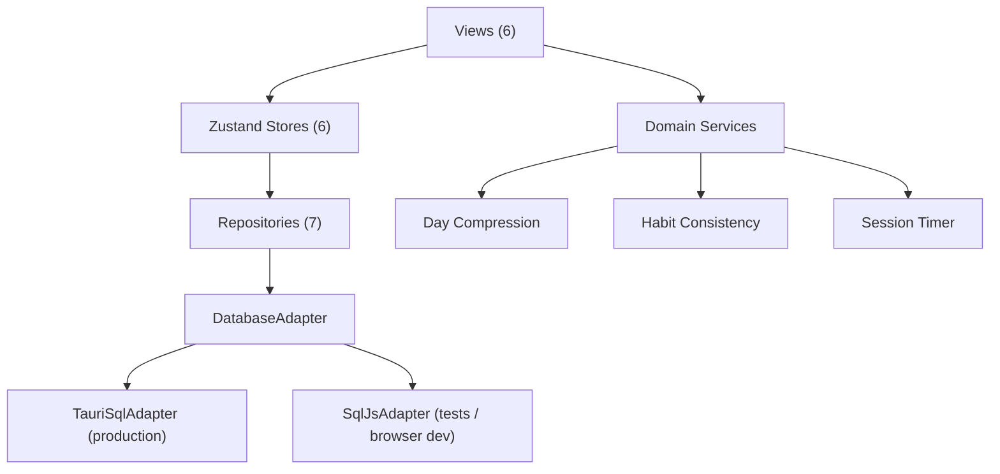

# Trajectory MVP — Walkthrough

> Commit: `1fed554` on `main`
> Status: **All gates green** — typecheck ✅ · 16/16 tests ✅ · production build ✅ · dev server running ✅

---

## What Was Built

Trajectory is a personal execution operating system designed to answer: *"What the hell should I actually be doing right now?"* This MVP delivers the full vertical stack — from SQLite persistence to reactive UI.

### Architecture



---

### Layer-by-Layer

#### 1. Domain Models — [types.ts](file:///c:/Users/sarth/Documents/Habit%20tracker/trajectory/src/domain/models/types.ts)

12 Zod-validated entities covering the full execution lifecycle:

| Entity | Purpose |
|--------|---------|
| `Area` | Life domains (Health, Work, Learning…) |
| `Goal` | Long-term objectives under areas |
| `Project` | Concrete deliverables under goals |
| `Task` | Atomic units of work with importance/cognitive-demand |
| `Action` | Sub-steps within tasks |
| `Habit` | Recurring behaviors with dual targets (minimum viable + normal) |
| `HabitLog` | Continuous daily habit values |
| `WorkSession` | Timed execution blocks with interruption tracking |
| `DailyState` | Subjective 1–10 readings (energy, clarity, stress, social battery) |
| `DailyReview` | 90-second shutdown reflection records |
| `RabbitHole` | Captured tangents with task/project provenance |
| `BrainDump` | Persistent freeform scratchpad |

#### 2. Database — [database.ts](file:///c:/Users/sarth/Documents/Habit%20tracker/trajectory/src/repositories/database.ts)

- `DatabaseAdapter` interface with `execute()` and `select()` methods
- `TauriSqlAdapter` — wraps `@tauri-apps/plugin-sql` for native desktop
- `SqlJsAdapter` — wraps `sql.js` for browser dev and Vitest testing
- Full migration runner reading [001_initial_schema.sql](file:///c:/Users/sarth/Documents/Habit%20tracker/trajectory/src/repositories/migrations/001_initial_schema.sql)

#### 3. Repositories (7)

| Repository | File |
|------------|------|
| Task CRUD + importance ordering | [taskRepository.ts](file:///c:/Users/sarth/Documents/Habit%20tracker/trajectory/src/repositories/taskRepository.ts) |
| Habit + dual-target logs | [habitRepository.ts](file:///c:/Users/sarth/Documents/Habit%20tracker/trajectory/src/repositories/habitRepository.ts) |
| Work sessions + interruptions | [workSessionRepository.ts](file:///c:/Users/sarth/Documents/Habit%20tracker/trajectory/src/repositories/workSessionRepository.ts) |
| Daily state readings | [stateRepository.ts](file:///c:/Users/sarth/Documents/Habit%20tracker/trajectory/src/repositories/stateRepository.ts) |
| Shutdown reviews | [reviewRepository.ts](file:///c:/Users/sarth/Documents/Habit%20tracker/trajectory/src/repositories/reviewRepository.ts) |
| Rabbit hole captures | [rabbitHoleRepository.ts](file:///c:/Users/sarth/Documents/Habit%20tracker/trajectory/src/repositories/rabbitHoleRepository.ts) |
| Brain dump scratchpad | [brainDumpRepository.ts](file:///c:/Users/sarth/Documents/Habit%20tracker/trajectory/src/repositories/brainDumpRepository.ts) |

#### 4. Domain Services

| Service | Purpose | File |
|---------|---------|------|
| Day Compression | Deterministic overflow algorithm — preserves critical/completed, fits important, defers rest | [compression.ts](file:///c:/Users/sarth/Documents/Habit%20tracker/trajectory/src/domain/compression/compression.ts) |
| Habit Consistency | Rolling window scoring with 0.6 weight for minimum-viable days | [consistency.ts](file:///c:/Users/sarth/Documents/Habit%20tracker/trajectory/src/domain/habits/consistency.ts) |
| Session Timer | Duration formatting and estimate-vs-actual delta | [timer.ts](file:///c:/Users/sarth/Documents/Habit%20tracker/trajectory/src/domain/sessions/timer.ts) |

#### 5. Zustand Stores (6)

- [useTaskStore](file:///c:/Users/sarth/Documents/Habit%20tracker/trajectory/src/stores/useTaskStore.ts) — task CRUD, active task, compression
- [useHabitStore](file:///c:/Users/sarth/Documents/Habit%20tracker/trajectory/src/stores/useHabitStore.ts) — habit loading and logging
- [useSessionStore](file:///c:/Users/sarth/Documents/Habit%20tracker/trajectory/src/stores/useSessionStore.ts) — deep work session lifecycle
- [useStateStore](file:///c:/Users/sarth/Documents/Habit%20tracker/trajectory/src/stores/useStateStore.ts) — energy/clarity/stress/social readings
- [useReviewStore](file:///c:/Users/sarth/Documents/Habit%20tracker/trajectory/src/stores/useReviewStore.ts) — shutdown review persistence
- [useUIStore](file:///c:/Users/sarth/Documents/Habit%20tracker/trajectory/src/stores/useUIStore.ts) — view routing, modal state, execution mode

#### 6. UI Views & Components

**6 Views:**
| View | Key Feature | File |
|------|-------------|------|
| Today | Primary objective cockpit, workload bar, state sliders | [TodayView.tsx](file:///c:/Users/sarth/Documents/Habit%20tracker/trajectory/src/views/TodayView.tsx) |
| Deep Work | Calm focused timer with pause/resume and interruption tracking | [DeepWorkView.tsx](file:///c:/Users/sarth/Documents/Habit%20tracker/trajectory/src/views/DeepWorkView.tsx) |
| Habits | Dual-target progress bars, quick-log, rolling consistency | [HabitsView.tsx](file:///c:/Users/sarth/Documents/Habit%20tracker/trajectory/src/views/HabitsView.tsx) |
| Projects | Area → project → task hierarchy browser | [ProjectsView.tsx](file:///c:/Users/sarth/Documents/Habit%20tracker/trajectory/src/views/ProjectsView.tsx) |
| Brain Dump | Freeform scratchpad with extract-to-task | [BrainDumpView.tsx](file:///c:/Users/sarth/Documents/Habit%20tracker/trajectory/src/views/BrainDumpView.tsx) |
| Review | 90-second shutdown ritual with state + reflection | [ReviewView.tsx](file:///c:/Users/sarth/Documents/Habit%20tracker/trajectory/src/views/ReviewView.tsx) |

**Keyboard Shortcuts** — [useKeyboardShortcuts.ts](file:///c:/Users/sarth/Documents/Habit%20tracker/trajectory/src/hooks/useKeyboardShortcuts.ts):
- `N` — New Task modal
- `D` — Enter Deep Work
- `R` — Rabbit Hole capture
- `Space` — Pause/Resume session
- `Ctrl+K` — Command palette
- `Esc` — Close modals

---

## Test Results

```
 ✓ src/domain/sessions/timer.test.ts          (2 tests)
 ✓ src/domain/compression/compression.test.ts (3 tests)
 ✓ src/domain/habits/consistency.test.ts      (2 tests)
 ✓ src/stores/useTaskStore.test.ts            (2 tests)
 ✓ src/repositories/database.test.ts          (4 tests)
 ✓ src/views/TodayView.test.tsx               (1 test)
 ✓ src/views/DeepWorkView.test.tsx            (2 tests)

 Test Files  7 passed (7)
      Tests  16 passed (16)
```

## Verification Summary

| Gate | Status |
|------|--------|
| `pnpm typecheck` (tsc --noEmit) | ✅ Zero errors |
| `pnpm test` (vitest run) | ✅ 16/16 passing |
| `pnpm build` (tsc + vite build) | ✅ 285 KB gzipped JS bundle |
| Dev server (vite --port 1420) | ✅ Running at http://127.0.0.1:1420/ |
| Git commit | ✅ `1fed554` on `main` |

---

## How to Run

```bash
# Development
pnpm dev              # Vite dev server at :1420

# Testing
pnpm test             # Vitest with sql.js in-memory DB

# Production build (frontend only)
pnpm build            # tsc + vite build → dist/

# Native desktop (requires Rust + Tauri CLI)
pnpm tauri dev        # Launches native window
pnpm tauri build      # Creates installer
```

## Next Steps (Roadmap Phase 2+)

- [ ] Wire `pnpm tauri dev` to launch the native desktop window
- [ ] Add real data seeding for areas, goals, and projects
- [ ] Weekly review aggregation view with behavioral trends
- [ ] Notification system (Tauri notification plugin)
- [ ] Session analytics with Recharts visualizations
- [ ] Brain dump → task extraction with NLP parsing
